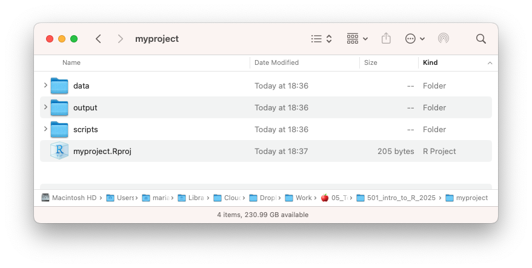

```{css, echo = FALSE, message = F}
@import url('https://fonts.googleapis.com/css2?family=Bebas+Neue:wght@400;700&display=swap');
pre {
    display: block;
    font-family: monospace;
    white-space: pre;
    margin: 1em 0px;
    margin-top: 0em;
    margin-right: 0px;
    margin-bottom: 0em;
    margin-left: 0px;
    white-space: pre-wrap;
}

p {
    line-height: 22px;
}

h1{
  margin-bottom: -20px;
}

h2{
  margin-bottom: -11px;
}

h3{
  margin-bottom: -10px;
}

.emphasized {
   font-size: 1.2em;
   font-family: Nunito;
}

.greenemph {
   font-size: 1.2em;
   font-family: Nunito;
   color: #69995D
}

.greenhead {
   font-size: 35px;
   font-family: Nunito;
   color: #69995D
}

.nunito {
   font-size: 25px;
   font-family: Nunito;
}

.nunitosm {
   font-family: Nunito;
}
.nunitosmgrey {
   font-family: Nunito;
   color: #E8E9E8
}

.invisible {
   color: white;
}

.remark-code {
background: #green;
}
.remark-slide-number {
  font-size: 10pt;
  margin-bottom: -11.6px;
  margin-right: 10px;
  color: #FFFFFF; /* white */
  opacity: 0; /* default: 0.5 */
}
    

```

```{r, echo = F}
# save the built-in output hook
hook_output <- knitr::knit_hooks$get("output")

# set a new output hook to truncate text output
knitr::knit_hooks$set(output = function(x, options) {
  if (!is.null(n <- options$out.lines)) {
    x <- xfun::split_lines(x)
    if (length(x) > n) {
      # truncate the output
      x <- c(head(x, n), "....\n")
    }
    x <- paste(x, collapse = "\n")
  }
  hook_output(x, options)
})
```

```{r, echo = F, message = F}
library(xaringanthemer)
library(formatR)
library(stringr)
library(countdown)
```

```{r, echo = FALSE, eval = T, warning = F}
style_xaringan(
  link_color = "#296EB4",?
  text_color  ="#383338",
  padding = "20px 64px 3px 64px",
  code_highlight_color = "#CDEDF6", 
  code_inline_color = "#296EB4",
  code_inline_background_color = "#CDEDF6",
  code_inline_font_size = ".7em",
  inverse_background_color = "#69995D",
  inverse_text_color = "#FFFFFF", 
  title_slide_background_color = "#FFFFFF", 
  title_slide_text_color = "#042A2B",
  header_h1_font_size = "60px",
  header_h2_font_size = "45px",
  header_h3_font_size = "35px",
  header_color = "#D84727",
  text_font_google = google_font("Inconsolata", "400", "500", "600"), 
  header_background_color = "#20408c",
  header_font_google = google_font("Nunito", "600", "700", "800"),
  header_font_weight = "bold",
  footnote_font_size = ".5em",
  code_font_size = "0.7rem",
  code_font_google = google_font("Roboto Mono", 500)
)
# to_pdf("01_data-manipulation-noanswers.html")

# Loved by the King, Gaegu, Barlow , Outfit, Archivo Black, Nunito *Syne* 
# Resources
# https://arm.rbind.io/slides/xaringan.html#116 
```

<br>
<br> 
<br> 
<br> 
<br> 
<br> 
<br> 
.center[
# DATA MANIPULATION
.nunito[LECTURE 1]
.greenhead[INTRO TO R PROGRAMMING]

**MARIA MONTOYA-AGUIRRE**

M1 APE @ PARIS SCHOOL OF ECONOMICS
]


---
<br>
##WELCOME TO THE COURSE!
.pull-left[
<span class="greenemph">**ABOUT ME**:</span> 
- PhD candidate at Paris School of Economics. Started APE in 2019! 
- Working on (labor ∩ crime ∩ development) economics 
- I've used R for +5 years now. 
]

.pull-right[
<span class="greenemph">**SOME ADVICE FOR M1**:</span> 
- Work consistently 
- Take care of yourself 
- Stay connected to the research
- Look for the questions/problems you care about 
]
<br>
<br>
**Econ podcasts I like:**

```{r, echo = F, fig.show="hold", out.width = "20%"}
par(mar = c(4, 3, .1, .1))


```

---
class:middle inverse
.center[
.nunito[
# ABOUT YOU

 WHAT IS YOUR NAME?
 
 WHERE ARE YOU FROM?
 
 ONE OF YOUR FAVORITE PROBLEMS
 
]]
---
## ABOUT THE COURSE
.emphasized[MAIN OBJECTIVE]

Learning R programming to carry out your empirical homeworks and research projects.

--

.emphasized[STRUCTURE]

 4 sessions (2h each) designed to introduce you to the main steps in the data analysis (~ empirical research) pipeline:
0. Data collection
1. Data cleaning and tidying **(Today!)**
2. Data analysis
  - Data visualization **(Lecture 2)**
  - Econometrics **(Lecture 4)**
3. Report results & publish code  **(Lecture 3)**


--

.emphasized[COURSE WEBSITE]

 https://github.com/mariamontoyaa/2023-intro-to-R-public 

🚨 Read the class policies and instructions for asking for help. 
 
 
---
# AGENDA
.nunitosm[
.pull-left[
- GETTING STARTED WITH R
  - THE R STUDIO IDE
  - OBJECTS AND FUNCTIONS
  - IMPORTING DATA

- ANATOMY OF A DATA FRAME
  - SCALARS
  - VECTORS
  - DATAFRAMES
  - SUBSETTING
]

.pull-right[
- MANIPULATING DATA WITH {dplyr}
  - PACKAGES
  - MAIN FUNCTIONS
  - `group_by()` vs. `summarise()`

- THE DATA ANALYSIS PIPELINE
  - A CHECKLIST FOR CLEANING DATA
  - LOOKING FOR HELP
]
 ]
---

### 💬 A Note on AI Tools

You’ll soon see that tools like ChatGPT  
can be **incredibly helpful** for learning R.

But **today**, we’re focusing on **foundations** —  
how to read code, write it, and think through problems.


 ⏳**For Today**

> **Please don’t use AI during this session.**  
> Let your brain do the debugging !

Why?

-  Struggling helps you learn  
-  You’re building foundations that will make AI more useful later  
- ️ We’ll talk about AI **at the end of class**

🧭**What to Do Instead**
- Use the documentation in R
- Read error messages carefully  
- Ask a neighbor or raise your hand 


---

 
## GETTING STARTED WITH R
Programming language and software environment for statistical computing and graphics. Widely used in Economics, Statistics and Biostatistics.

  .pull-left[
.greenemph[WHY SHOULD WE LEARN TO CODE?] 

  Transparent, shareable and reproducible analysis
  

  ]
  .pull-right[
```{r, echo = F}


```
  ]
---
 
## GETTING STARTED WITH R
Programming language and software environment for statistical computing and graphics. Widely used in Economics, Statistics and Biostatistics.

  .pull-left[
.greenemph[WHY SHOULD WE LEARN TO CODE?] 

  Transparent, shareable and reproducible analysis
  
.greenemph[WHY CHOOSE **R**?] <br>
  - Free and open source. Development of features and fixes is fast
  - Less specialized
  - Easy to Google
  - Pretty graphs (and [accidental art](https://twitter.com/accidental__aRt))
  - Super versatile: pretty graphs, GIS integration for maps, web scrapping, machine learning, markdown, dashboards 

  ]
  .pull-right[
```{r, echo = F}


```
  ]
---
### THE **R** STUDIO **IDE** 
An **Integrated Development Environment** provides the comprehensive facilities for programmers in an application

```{r, echo = F, out.width = "90%"}


```
---
### THE **R** STUDIO **IDE** 
An **Integrated Development Environment** provides the comprehensive facilities for programmers in an application

```{r, echo = F, out.width = "90%"}


```
---
### SOURCE
.nunito[You'll spend most of you time here!] Where you write and save code  
--
(File > New File > R Script) 
📌 **First thing:** Save your script! 
--

- An `#` allows to comment your code. Everything after it is ignored until a line break
- Separate different commands with a **line break** for clarity. But, note that a space doesn't break a command. 

--
- Run and source buttons send code to the console to be executed 
  - Run (from selection). Highlight the code  → `Ctrl + Enter`. If no code is selected it will run the line where the cursor is. 
  - Source (run everything)

--
```{r, echo = T, eval = F}
1 + 1 # Equals two?

1 +   # Also equals two? 
  1   # R recognizes that you are not done yet! 
      
1
+ 1   # Equals one. 

```
---
### SOURCE
.nunito[You'll spend most of you time here!] Where you write and save code  
(File > New File > R Script) 
📌 **First thing:** Save your script! 

- An `#` allows to comment your code. Everything after it is ignored until a line break
- Separate different commands with a **line break** for clarity. But, note that a space doesn't break a command. 
- Run and source buttons send code to the console to be executed 
  - Run (from selection). Highlight the code  → `Ctrl + Enter`. If no code is selected it will run the line where the cursor is. 
  - Source (run everything)


```{r, echo = T, eval = T}
1 + 1 # Equals two?

1 +   # Also equals two? 
  1   # R recognizes that you are not done yet! 
      
1
+ 1   # Equals one. 

```
---
<br>
<br>
<br>
<br>
<br>
### CONSOLE
.nunito[The heart of the operation 🫀] 

Here is where you communicate with R to get it to do things. 

--
- You write after the `>` prompt. It means that R is ready for a new instruction. Press enter and R will execute the code.
- You can write there directly for quick calculations or fleeting requests you don't need to save. 

--

.greenemph[**WRITE MOST OF YOUR CODE IN THE SOURCE PANEL**] 

---
<br>
<br> 
### ENVIRONMENT
.nunito[Where we keep track of things 🖇️]

- Data analysis requires manipulating different *objects*: datasets, vectors, functions, etc. Here is where we keep track of them. 

--
- R is an **object-oriented** language. We'll talk about this in a bit. What it means is that we can see everything we are working with and things are only stored when we ask to.

--
- We **assign** a value to an object with `<-` the assignment operator


--
**See what happens in the environment panel when we run this:**
```{r, echo = T, eval = T, results = F}
5 + 1
x <- 5    # Assigning the value 
x
x + 1
x
x <- x + 1 # Assigning a new value 
x 
  
```

---
<br>
### ENVIRONMENT
.nunito[Where we keep track of things 🖇️]

- Data analysis requires manipulating different *objects*: datasets, vectors, functions, etc. Here is where we keep track of them. 
- R is an **object-oriented** language. We'll talk about this in a bit. What it means is that we can see everything we are working with and things are only stored when we ask to.
- We **assign** a value to an object with `<-` the assignment operator

**See what happens in the environment panel when we run this:**
```{r, echo = T, eval = T, results = T}
5 + 1
x <- 5    # Assigning the value 
x
x + 1
x
x <- x + 1 # Assigning a new value 
x 
  
```

---
class: middle
### FILES/ PLOTS/ ... PANEL
.nunito[Many helpful things here 🗄️]
- Files shows your *working directory*, the default location of any files you read into or save out of R  `getwd()`
  - We'll see more about how to work with directories and R Projects in **Lecture 3**

--
- Plots / Viewer 
- Packages
- Help 
  - Add a `?` in front of any function to get help: `?getwd()` 

---
## OBJECTS AND FUNCTIONS
R revolves around 2 things: **objects and functions** (things and procedures?)

.pull-left[
- **Objects** are vectors, dataframes, regression models. They have attributes. 
<br>
- **Functions** are procedures that typically take one or more objects as arguments (inputs), do something with them and return a new object 

]

.pull-right[


```{r, eval = F}
# This is not R code 
window <- "This is a window"
door <- "This is a door" 
one_hundred <- 100
two_thousand <- 2000
```
```{r, eval = F}
# This is not R code
open(window)
open(door)
open(book)

clean(toilet)
clean(data)
clean(conscience)

```
]
--
<br>
.center[
.nunito[Programming in R is defining objects and applying functions to those objects ad infinitum]
]

```{r, eval = T}
# This is R code 
grades <- c(15, 10, 12, 13, 18)
mean(grades) 

```
---
## PACKAGES

.nunito[There are **tons** of user-created functions, they come bundled in ***packages***]

- Some functions are built into R itself — this is called the **{base}** package.
- Most extra functions live in packages hosted on the **Comprehensive R Archive Network (CRAN)**.

--  
 
 
.nunito[💡 A package is like a lightbulb]

You need to:
- **Install** it once: `install.packages("package_name")`
- **Turn it on** every time you need it: `library(package_name)`

--

**You can also call a function without loading the package**:  
 `package_name::function` <br> **Advantage**: clear for others which package is it coming from, avoids conflicts when packages have functions with the same name. <br> **Disadvantage:** Not practical for functions you use often.
  
---

class:middle inverse
.center[
.nunito[
# NOW WE ARE GOING TO WORK WITH DATA

BUT FIRST,
LET'S GET OUR FILES ORGANIZED
 
]]
---
<br>

.greenhead[**FILE PATHS, FOLDERS & PROJECTS**]


**🗺️ What's a file path?** 

It's like directions to a file on your computer. R needs to know where to find your data. 
- **Absolute** paths:   
`"C:/Users/Maria/Documents/myproject/data/myfile.csv"` Windows
`"/Users/maria/Documents/myproject/data/myfile.csv"` Mac 
- **Relative paths:** `"data/myfile.csv"` 

**📁Recommended folder structure** 
```{r, echo = T, eval = F, results = F}
myproject/               ← 📁 Your project folder
├── data/                ← data files (CSV, DTA, etc.)
├── scripts/             ← R scripts 
├── output/              ← tables, figures, model results
├── myproject.Rproj      ← your R Project file
```


---
<br>

.greenhead[**FILE PATHS, FOLDERS & PROJECTS**]

**🗺️ What's a file path?** 
- **Absolute** paths:   
`"C:/Users/Maria/Documents/myproject/data/myfile.csv"` Windows
`"/Users/maria/Documents/myproject/data/myfile.csv"` Mac 
- **Relative paths:** `"data/myfile.csv"` 

**📁Recommended folder structure**
```{r, echo = F} 


```


---

<br>

.greenhead[**FILE PATHS, FOLDERS & PROJECTS**]

**📦Create an R Project in RStudio** 
1. **File -> New Project** 
2. Select **New Directory** or **Existing Directory**
3. Name the project (e.g. `intro_to_R`)
4. Open the `.Rproj` file every time you work 

📍**Using `here()` for Clean File Paths** 
```{r, echo = T, eval = F}
install.packages("here")  # Install the package
library(here)              # Load the package
here("data", "myfile.csv") # Relative path 
"C:/Users/Maria/Documents/myproject/data/myfile.csv" # Absolute path

```


---

<br>

.greenhead[**IMPORTING AND INSPECTING DATA**]

📥 **Download the data folder from the course website** 
- We are going to analyze the 250 top rated French Movies in IMDB
- Open the CSV file in your computer and inspect it: columns are variables and rows are observations


---
<br>

.greenhead[**IMPORTING AND INSPECTING DATA**]

📥 **Download the data folder from the course website** 
- We are going to analyze the 250 top rated French Movies in IMDB
- Open the CSV file in your computer and inspect it: columns are variables and rows are observations

.nunito[How do we get this data into R?]
- We import it using *read* functions, which take a file path as an input and give the file content as an output. 

🚨 Use forward slashes `"mycomputer/folder/file.csv"` instead of backward slashes `"mycomputer\folder\file.csv"`

```{r, echo = F, eval = T, results = F}
imdb <- read.csv("../data/01_imdb-top250-french.csv")

```

```{r, eval = F}
imdb <- read.csv(here("data", "01_imdb-top250-french.csv"))

# Exploring the data 
head(imdb, 4)   # Show first four rows
tail(imdb, 3)   # Show last three rows
View(imdb)      # Show data in a spreadsheet view

```
---

<br> 
<br>
.greenhead[**DID WE DO IT RIGHT?**]

<br>

```{r, echo = F} 


```


---
<br> 
<br>
.greenhead[**DID WE DO IT RIGHT?**]

<br>

```{r, echo = F} 


```

---
<br>
<br>
### USING FUNCTIONS
- Read the documentation! `?read.csv()`
  - Description
  - Usage 
  - Arguments: with and without default values (you need to write these to work)
  - ⭐️ Examples 

--
```{r, eval = F, echo = T}
read.csv(file, header = TRUE, sep = ",", quote = "\"",
         dec = ".", fill = TRUE, comment.char = "", ...)
```
- You don’t need to write argument names if you write the arguments in the correct order 

---
<br>
<br>
### SO, WHAT HAPPENED?
.nunito[A common problem when importing data is that the *character encoding* is handled incorrectly. ]

This is when we see weird characters like `é` where letters should be. 

--

All the characters we see, like `1` ,`#` or `M`, are produced by a sequence of bits (1-0), the encoding determines how these bits are translated into characters. 

--

We need to make sure we are using the right *translation*! 

```{r, eval = F}
imdb <- read.csv(here("data", "01_imdb-top250-french.csv"),
                 encoding = "UTF-8") #UTF-8 should work for latin languages #<< 

```

---
### WHEN THINGS DON'T GO WELL... DEBUGGING🐞
**Go line by line making sure each command does what you expect it to. **

Most of the time the problem is one of these:

--
- **R isn't ready:** The `>` should appear in the console. There is a `+` instead. You wrote something *incomplete* before and R is waiting for you to finish. Press `ESC`.  <br> ` c(1, 3, `

--
- **Mispelled object or function** Letter reversals or capitalization are often the issue.<br> `maen(1, 2, 3)`, `Mean(1, 2, 3)`

--
- **Punctuation problems** Mixing commas `,` and periods `.` or incorrect use of `" "`. <br>
  `c(1,2.3)`

--
- **Wrong argument** 

--
- **Missing arguments** 
--

.center[.nunito[**🌈 READ CAREFULLY 🌈**]]

---
class: inverse
## EXERCISE
I want to:
- Create a vector with 20 numbers drawn from a normal distribution with a mean of 5 and standard deviation of 2. 
- Obtain its median. 

.nunito[Fix the following code. 

🔍 Start with `?rnorm()`]

.pull-left[
```{r, eval = F, echo = T}
v1 <- rnorm(2, 20)


Median(v1)
```

]

`r countdown(minutes = 2, seconds = 0)`

---
# AGENDA
.nunitosm[

.pull-left[
.nunitosmgrey[
- GETTING STARTED WITH R
  - THE R STUDIO IDE
  - OBJECTS AND FUNCTIONS
  - IMPORTING DATA
]
- ANATOMY OF A DATA FRAME
  - SCALARS
  - VECTORS
  - DATAFRAMES
  - SUBSETTING
]

.pull-right[
- MANIPULATING DATA WITH {dplyr}
  - PACKAGES
  - MAIN FUNCTIONS
  - `group_by()` vs. `summarise()`

- THE DATA ANALYSIS PIPELINE
  - A CHECKLIST FOR CLEANING DATA
  - LOOKING FOR HELP
]
 ]
---


class: split-three


## ANATOMY OF A DATA FRAME

What makes up a dataset? The smallest unit of data:

.nunito[SCALARS]

---
class: split-three


## ANATOMY OF A DATA FRAME

What makes up a dataset? The smallest unit of data:

.nunito[SCALARS]

.column[
<br>
<br>
<br>
<br>
<br>
<br>
<br>
<br>
.center[
*Numeric*]
```{r, echo = T, eval = F}
a <- 100
b <- 3 / 100
c <- (a + b) / b 
```
Try: `class(a)`

- *int:* round numbers <br> *dbl:* 2 decimals
]


.column[
<br>
<br>
<br>
<br>
<br>
<br>
<br>
<br>
.center[
*Character*]
```{r, echo = T, eval = F}
d <- "window"
e <- "4"
f <- "This is a room" 
```
Try: `class(d)`

- Also called *strings* 
]


.column[
<br>
<br>
<br>
<br>
<br>
<br>
<br>
<br>
.center[
*Boolean*]
```{r, echo = T, eval = F}
g <- TRUE
h <- (3 >= 4) 
i <- (c == (a+b) / b)
```
Try: `class(g)`

- Produced with operators <br> `== > < >= <= & | !` 
]
<br>
<br>
<br>
<br>
<br>
<br>
<br>
<br>
<br>
<br>
<br> 
---
class: split-three


## ANATOMY OF A DATA FRAME

What makes up a dataset? The smallest unit of data:

.nunito[SCALARS]

.column[
<br>
<br>
<br>
<br>
<br>
<br>
<br>
<br>
.center[
*Numeric*]
```{r, echo = T, eval = F}
a <- 100
b <- 3 / 100
c <- (a + b) / b 
```
Try: `class(a)`

- *int:* round numbers <br> *dbl:* 2 decimals
]


.column[
<br>
<br>
<br>
<br>
<br>
<br>
<br>
<br>
.center[
*Character*]
```{r, echo = T, eval = F}
d <- "window"
e <- "4"
f <- "This is a room" 
```
Try: `class(d)`

- Also called *strings* 
]


.column[
<br>
<br>
<br>
<br>
<br>
<br>
<br>
<br>
.center[
*Boolean*]
```{r, echo = T, eval = F}
g <- TRUE
h <- (3 >= 4) 
i <- (c == (a+b) / b)
```
Try: `class(g)`

- Produced with operators <br> `== > < >= <= & | !` 
]
<br>
<br>
<br>
<br>
<br>
<br>
<br>
<br>
<br>
<br>
<br> 
.center[
.greenemph[What happens if we execute this?]

]
```{r, echo = T, eval = F}
a + b
a + e           
a + as.numeric(e) 
as.numeric(d)    
as.character(a)   
``` 
---
class: split-three


## ANATOMY OF A DATA FRAME

What makes up a dataset? The smallest unit of data:

.nunito[SCALARS]

.column[
<br>
<br>
<br>
<br>
<br>
<br>
<br>
<br>
.center[
*Numeric*]
```{r, echo = T, eval = F}
a <- 100
b <- 3 / 100
c <- (a + b) / b 
```
Try: `class(a)`

- *int:* round numbers <br> *dbl:* 2 decimals
]


.column[
<br>
<br>
<br>
<br>
<br>
<br>
<br>
<br>
.center[
*Character*]
```{r, echo = T, eval = F}
d <- "window"
e <- "4"
f <- "This is a room" 
```
Try: `class(d)`

- Also called *strings* 
]


.column[
<br>
<br>
<br>
<br>
<br>
<br>
<br>
<br>
.center[
*Boolean*]
```{r, echo = T, eval = F}
g <- TRUE
h <- (3 >= 4) 
i <- (c == (a+b) / b)
```
Try: `class(g)`

- Produced with operators <br> `== > < >= <= & | !` 
]
<br>
<br>
<br>
<br>
<br>
<br>
<br>
<br>
<br>
<br>
<br> 
.center[
.greenemph[What happens if we execute this?]

]
```{r, echo = T, eval = F}
a + b
a + e             # Error in a + e : non-numeric argument to binary operator
a + as.numeric(e) 
as.numeric(d)     # Character is coerced to NA (not available)
as.character(a)   
``` 

---
.center[
### DATA STRUCTURE
```{r, echo = F}


```
]
---
### VECTORS  
Unidimensional object that stores a sequence of values of the **same type**
```{r}
c("Hello world", 35, FALSE)     
```
--
```{r}
c("Hello world", as.character(35), as.character(FALSE))  # Equivalent to this
``` 
--

.nunito[Having the same type of values allows operations to apply to all elements in the vector]  

--

.pull-left[
```{r, eval = F}
v1 <- c(1, 2, 3)
v1
v1 / 3 
v1 * v1      # Multiply element wise
v1 %*% v1    # Matrix multiplication

```
]


.pull-right[ 
]
---
### VECTORS 
Unidimensional object that stores a sequence of values of the **same type**
```{r}
c("Hello world", 35, FALSE)     
```

```{r}
c("Hello world", as.character(35), as.character(FALSE))  # Equivalent to this
``` 

.nunito[Having the same type of values allows operations to apply to all elements in the vector]  


.pull-left[
```{r, eval = T}
v1 <- c(1, 2, 3)
v1
v1 / 3 
v1 * v1      # Multiply element wise
v1 %*% v1    # Matrix multiplication

```
]


.pull-right[ 

]
---
### VECTORS 
Unidimensional object that stores a sequence of values of the **same type**
```{r}
c("Hello world", 35, FALSE)     
```

```{r}
c("Hello world", as.character(35), as.character(FALSE))  # Equivalent to this
``` 

.nunito[Having the same type of values allows operations to apply to all elements in the vector]  


.pull-left[
```{r, eval = T}
v1 <- c(1, 2, 3)
v1
v1 / 3 
v1 * v1      # Multiply element wise
v1 %*% v1    # Matrix multiplication

```
]


.pull-right[ 
```{r, eval  = F}
# Creating vectors
v1 <- c(1, 1, 3, 5)    # Specify all 
v1
v2 <- c(1:5)           # Evenly spaced 
v2
v3 <- c(v1, v2)        # Combining  
v3


```
]
---
### VECTORS 
Unidimensional object that stores a sequence of values of the **same type**
```{r}
c("Hello world", 35, FALSE)     
```

```{r}
c("Hello world", as.character(35), as.character(FALSE))  # Equivalent to this
``` 

.nunito[Having the same type of values allows operations to apply to all elements in the vector]  


.pull-left[
```{r, eval = T}
v1 <- c(1, 2, 3)
v1
v1 / 3 
v1 * v1      # Multiply element wise
v1 %*% v1    # Matrix multiplication

```
]


.pull-right[ 
```{r}
# Creating vectors
v1 <- c(1, 1, 3, 5)    # Specify all 
v1
v2 <- c(1:5)           # Evenly spaced 
v2
v3 <- c(v1, v2)        # Combining  
v3


```
]
---
.center[
### DATA STRUCTURE
```{r, echo = F}


```
]
---

### DATA FRAMES AND SUBSETTING
<br>

--
Let's explore the dataset with function `str()`
```{r, echo = T, out.lines = 5}
str(imdb)
```

--

**A dataframe is a collection of vectors.** <br> We use `$` to select a variable of the dataset:
```{r, out.lines = 3}
imdb$Name
```
--
We can also use `$` to create and replace variables
```{r}
imdb$new_var <- c(250:1) # The vector has to be of the same length as the dataframe
```

---
### DATA FRAMES AND SUBSETTING
We can also use the **subsetting** operator `[]` to select a portion of our data. Like this: `data[row, column]` or `vector[element]`. 

--

.pull-left[
We indicate what we want to select using:

- Indices (position) 
  - *The second column*
- Logical operators 
  - *Movies ranked above 10*
- Names: 
  - *Columns "Rank" and "Duration"*
]

.pull-right[
**First row and cols "Name" and "Year": **
```{r, eval = F, echo = T}
imdb[1, c("Name", "Year")]
imdb[1, c(2, 4)]
```

]
---

### DATA FRAMES AND SUBSETTING
We can also use the **subsetting** operator `[]` to select a portion of our data. Like this: `data[row, column]` or `vector[element]`. 

.pull-left[
We indicate what we want to select using:

- Indices (position) 
  - *The second column*
- Logical operators 
  - *Movies ranked above 10*
- Names: 
  - *Columns "Rank" and "Duration"*
]

.pull-right[
**First row and cols "Name" and "Year": **
```{r, eval = F, echo = T}
imdb[1, c("Name", "Year")]
imdb[1, c(2, 4)]
```
**First 10 rows, all columns:**
```{r, eval = F, echo = T}
imdb[1:10,] 
imdb[-(11:250),]
```

]
---


### DATA FRAMES AND SUBSETTING
We can also use the **subsetting** operator `[]` to select a portion of our data. Like this: `data[row, column]` or `vector[element]`. 

.pull-left[
We indicate what we want to select using:

- Indices (position) 
  - *The second column*
- Logical operators 
  - *Movies ranked above 10*
- Names: 
  - *Columns "Rank" and "Duration"*
]

.pull-right[
**First row and cols "Name" and "Year": **
```{r, eval = F, echo = T}
imdb[1, c("Name", "Year")]
imdb[1, c(2, 4)]
```
**First 10 rows, all columns:**
```{r, eval = F, echo = T}
imdb[1:10,] 
imdb[-(11:250),]
```

**Name of the movies ranked 11-14 :**
```{r, eval = F}
imdb[Rank < 15 & Rank > 10, "Name" ] 
  # This doesn't work. Why?
imdb[imdb$Rank < 15 & 
       imdb$Rank > 10, "Name"]
``` 
]
---
class: inverse
<br>
<br>
<br>
### EXERCISE
- Create the  vector `c(7, 7, 8, 8, 7, 7, 8, 8)` using the function `rep()`

- Modify the code `seq(1, 6)` to get the vector c(0, 2, 4, 6)

- Get the name of the shortest movie in the data set <br>
 🔍 Use functions `min()`, `substr()`

- There are 6 movies that last 104 minutes, what are they called?

--
`r countdown(minutes = 10, seconds = 0)`


---
# AGENDA
.nunitosm[

.pull-left[
.nunitosmgrey[
- GETTING STARTED WITH R
  - THE R STUDIO IDE
  - OBJECTS AND FUNCTIONS
  - IMPORTING DATA

- ANATOMY OF A DATA FRAME
  - SCALARS
  - VECTORS
  - DATAFRAMES
  - SUBSETTING
]]

.pull-right[
- MANIPULATING DATA WITH {dplyr}
  - PACKAGES
  - MAIN FUNCTIONS
  - `group_by()` vs. `summarise()`

- THE DATA ANALYSIS PIPELINE
  - A CHECKLIST FOR CLEANING DATA
  - LOOKING FOR HELP
]
 ]

---
### MANIPULATING DATA WITH {dplyr}

.nunito[There are tooons of user-created functions, which come in ***packages***]

- So far we’ve only used functions that are already built in R, also known as ****{base}****
    - Packages are centralized on the Comprehensive R Archive Newtork (CRAN)

--
  
  
- An R package is like a lightbulb 💡. <br> First you need to install it `install.packages("package_name")`, <br>and then turn it on when you need it `library("package_name")` 
--
  
  - You can avoid loading the packages by specifying the package `package_name::function` <br> **Advantage**: clear for others which package is it coming from, avoids conflicts when packages have functions with the same name. <br> **Disadvantage:** Not practical for functions you use often.
  
--

- The 🌈[tidyverse](tidyverse.org) is an umbrella package that installs several pakages that are useful for data analysis and work well together: {tidyr}, {dplyr}, {ggplot2}, {tibble}, etc. 

    - **{dplyr}**:  data manipulation
    - **{tidyr}**: converting between different shapes 
    - **{ggplot2}**: creating plots 
    
---

## MAIN FUNCTIONS IN `dplyr`
**Grammar** of data manipulation with very user-friendly functions for the most common tasks:
.pull-left[
<table>
<tr>
<td> Function </td> <td> Description </td>  
</tr>
<tr>
<td> 

<pre>
  mutate()
</pre>

</td>
<td>

  Add / modify variables 

</td>
</tr>
<tr>
<td> 

<pre>
  select()
</pre>

</td>
<td>

Keep / drop variables (columns)

</td>
</tr>

<tr>
<td> 

<pre>
  filter()
</pre>

</td>
<td>

Keep / drop observations (rows) 

</td>
</tr>

<tr>
<td> 

<pre>
  arrange()
</pre>

</td>
<td>

Sort rows according to values of variables

</td>
</tr>

<tr>
<td> 

<pre>
  summarise()
</pre>

</td>
<td>

Aggregate data into descriptive statistics 

</td>
</tr>
</table>]

.pull-right[
]

---

## MAIN FUNCTIONS IN `dplyr`
**Grammar** of data manipulation with very user-friendly functions for the most common tasks:
.pull-left[
<table>
<tr>
<td> Function </td> <td> Description </td>  
</tr>
<tr>
<td> 

<pre>
  mutate()
</pre>

</td>
<td>

  Add / modify variables 

</td>
</tr>
<tr>
<td> 

<pre>
  select()
</pre>

</td>
<td>

Keep / drop variables (columns)

</td>
</tr>

<tr>
<td> 

<pre>
  filter()
</pre>

</td>
<td>

Keep / drop observations (rows) 

</td>
</tr>

<tr>
<td> 

<pre>
  arrange()
</pre>

</td>
<td>

Sort rows according to values of variables

</td>
</tr>

<tr>
<td> 

<pre>
  summarise()
</pre>

</td>
<td>

Aggregate data into descriptive statistics 

</td>
</tr>
</table>]

.pull-right[The **pipe operator** ` %>% ` or `|>` (Ctrl + Shift + M)
- Allows to chain functions you apply to an object
- Take X and do this, and this, and this, and ...
<video autosize: true controls>
  <source src="./01_pipe_baking.mp4" type="video/mp4">
</video>
]

---
## MAIN FUNCTIONS IN `dplyr`

```{r, eval = F}
install.packages("dplyr")      # Requires an internet connection
```
```{r, message=F}
library(dplyr)

```
<br>
```{r, out.lines = 10 }
imdb
```


---
## MAIN FUNCTIONS IN `dplyr`

```{r, eval = F}
install.packages("dplyr")      # Requires an internet connection
```
```{r, message=F}
library(dplyr)
```

```{r, out.lines = 10 }
imdb %>% 
  select(Name, Rank, Duration)                    # Keep selected vars

```
---
## MAIN FUNCTIONS IN `dplyr`

```{r, eval = F}
install.packages("dplyr")      # Requires an internet connection
```
```{r, message=F}
library(dplyr)
```

```{r, out.lines = 10 }
imdb %>% 
  select(Name, Rank, Duration) %>%                 # Keep selected vars
  mutate(top50 = (Rank <= 50))                     # Create a new variable
  
```
---

## MAIN FUNCTIONS IN `dplyr`

```{r, eval = F}
install.packages("dplyr")      # Requires an internet connection
```
```{r, message=F}
library(dplyr)
```

```{r, out.lines = 10 }
imdb %>% 
  select(Name, Rank, Duration) %>%                 # Keep selected vars
  mutate(top50 = (Rank <= 50)) %>%                 # Create a new variable
  mutate(Duration =
           as.numeric(substr(Duration, 1, 3)))     # Modify existing var
```
---

## MAIN FUNCTIONS IN `dplyr`

```{r, eval = F}
install.packages("dplyr")      # Requires an internet connection
```
```{r, message=F}
library(dplyr)
```

```{r, out.lines = 10 }
imdb %>% 
  select(Name, Rank, Duration) %>%                 # Keep selected vars
  mutate(top50 = (Rank <= 50)) %>%                 # Create a new variable
  mutate(Duration =
           as.numeric(substr(Duration, 1, 3))) %>% # Modify existing var
  filter(Name != "Amélie")                         # Keep/drop certain rows
```
---
## MAIN FUNCTIONS IN `dplyr`

```{r, eval = F}
install.packages("dplyr")      # Requires an internet connection
```
```{r, message=F}
library(dplyr)
```

```{r, out.lines = 10 }
imdb %>% 
  select(Name, Rank, Duration) %>%                 # Keep selected vars
  mutate(top50 = (Rank <= 50)) %>%                 # Create a new variable
  mutate(Duration =
           as.numeric(substr(Duration, 1, 3))) %>% # Modify existing var
  filter(Name != "Amélie") %>%                     # Keep/drop certain rows
  arrange(-Rank)                                   # Sort rows
```
---
## MAIN FUNCTIONS IN `dplyr`

```{r, eval = F}
install.packages("dplyr")      # Requires an internet connection
```
```{r, message=F}
library(dplyr)
```

```{r, out.lines = 10 }
imdb %>% 
  select(Name, Rank, Duration) %>%                 # Keep selected vars
  mutate(top50 = (Rank <= 50)) %>%                 # Create a new variable
  mutate(Duration =
           as.numeric(substr(Duration, 1, 3))) %>% # Modify existing var
  filter(Name != "Amélie") %>%                     # Keep/drop certain rows
  arrange(-Rank) %>%                               # Sort rows
  summarise(avg_dur = mean(Duration),              # Aggregate into statistics 
            min_dur = min(Duration),
            max_dur = max(Duration))
```
---
## MAIN FUNCTIONS IN `dplyr`
Two useful functions for `mutate()`  

`ifelse()`
```{r}
imdb %>% 
  select(Name, Type) %>% 
  mutate(restricted = ifelse(Type %in% c("R", "X", "18"), 
                             TRUE, 
                             FALSE )) %>% 
  head()
```


---

## MAIN FUNCTIONS IN `dplyr`
Two useful functions for `mutate()`  

`ifelse()`
```{r, eval = F}
imdb %>% 
  select(Name, Type) %>% 
  mutate(restricted = ifelse(Type %in% c("R", "X", "18"), 
                             TRUE, 
                             FALSE )) %>% 
  head()
```


`case_when()`
```{r, echo = T}
imdb <- 
imdb %>% 
  mutate(audience = case_when(Type %in% c("R", "X", "18") ~ "Over 17" , 
                              Type %in% c("PG", "PG-13") ~ "Parental guidance",
                              Type == "" ~ "No information",
                              .default = "General audiences")) 
```
```{r, echo = F}
imdb %>% 
  select(Name, Type, audience) %>% 
  head()
```

---
### group_by() AND summarise()
- `group_by()` allows you to do computations separately for different parts of the data 
```{r}
imdb %>% 
  mutate(mean_all = mean(Rating, na.rm = TRUE)) %>% 
  group_by(audience) %>%   #<< 
  mutate(mean_aud = mean(Rating, na.rm = TRUE)) %>% 
  select(Name, audience, Rating, mean_all, mean_aud) %>% 
  head(5)
```
--

- It will apply to all subsequent operations. You need to `ungroup()` to cancel its effect
```{r, echo = T, eval = F}
imdb %>% 
  group_by(audience) %>%   
  mutate(mean_aud = mean(Rating, na.rm = TRUE)) %>% 
  ungroup() %>%  #<<
  mutate(mean_all = mean(Rating, na.rm = TRUE)) 
```

---
### group_by() AND summarise()
`group_by()` is also useful with `summarise()`

.pull-left[

  - Keeps the grouping variable 
  - Computes statistics for each group 

```{r}
  imdb %>% 
    group_by(audience) %>% 
    summarise(n = n(),  
              avg_rating = mean(Rating)) 
```

  ]
  
.pull-right[
- `summarise()` by itself computes statistics for the whole dataset
<br> 
<br>
```{r}
  imdb %>% 
    summarise(n = n(),  
              avg_rating = mean(Rating)) 
```

]
--

<br> 
.center[🚨 `mutate()` ≠ `summarise()`

 `mutate()` transforms a vector onto another **vector**

 `summarise()` transforms a vector onto a **value**
]
---
class: inverse
<br>
<br>
# EXERCISE

- Create a table that shows the share of comedies and dramas in the sample. 🔍 Use functions `str_detect()` from package {stringr} and `mean()`  


- Create a variable *category* that classifies movies into short or long depending on whether or not they exceed 40 min., and create a separate ranking by category. 🔍 Use function `rank()` and don't forget to fix the *Duration* variable if you haven't: `as.numeric(substr(Duration, 1, 3))`

--

**When overwhelmed, break down tasks into smaller steps!! Step away from the screen if you need to.**  
`r countdown(minutes = 8, seconds = 0)`

---
# AGENDA
.nunitosm[
.nunitosmgrey[
.pull-left[

- GETTING STARTED WITH R
  - THE R STUDIO IDE
  - OBJECTS AND FUNCTIONS
  - IMPORTING DATA

- ANATOMY OF A DATA FRAME
  - SCALARS
  - VECTORS
  - DATAFRAMES
  - SUBSETTING
]]

.pull-right[
.nunitosmgrey[

- MANIPULATING DATA WITH {dplyr}
  - PACKAGES
  - MAIN FUNCTIONS
  - `group_by()` vs. `summarise()`
]
- THE DATA ANALYSIS PIPELINE
  - A CHECKLIST FOR CLEANING DATA
  - LOOKING FOR HELP
]
 ]

---
class:middle

.center[
```{r, echo = F}
DiagrammeR::grViz("digraph {
  graph [layout = dot, rankdir = TB          ]
  
  node [shape = rectangle,
        fontname = Nunito,
        fontsize = 14]        
  rec1 [label = '🕵🏾 DATA COLLECTION']
  rec2 [label = '🧹 DATA CLEANING / TIDYING',
        color = '#D84727']
  rec3 [label = '📊DATA ANALYSIS']
  rec4 [label = '📑REPORT RESULTS']
  
  # edge definitions with the node IDs
  rec1 -> rec2 -> rec3 -> rec4
  }",
  width = 600)
```
]
---
### A CHECKLIST FOR CLEANING DATA
We've learned the tools for manipulating data. What does it mean to clean and tidy our data?

- Variable management: *is the data stored in the right way?*

- Data tidying: *is the structure of the data right?* 

- Documentation: *is the data understandable to others?*

- Data aggregation: *do we have all we need in the same place?* 


---
### A CHECKLIST FOR CLEANING DATA
We've learned the tools for manipulating data. What does it mean to clean and tidy our data?

- Variable management: *is the data stored in the right way?*
  - Missing values `is_na()`, `NA_real_`, `NA_character_` <br> 🏴‍☠️ 0s are replacing missing values
  - Storage types (are numbers numbers?)
  - Formats are inconsistent 
  - More here: [Quartz guide to bad data and how to solve them](https://github.com/Quartz/bad-data-guide#values-are-missing)
- Data tidying: *is the structure of the data right?* 

- Documentation: *is the data understandable to others?*
 
- Data aggregation: *do we have all we need in the same place?* 

---
### A CHECKLIST FOR CLEANING DATA
We've learned the tools for manipulating data. What does it mean to clean and tidy our data?

- Variable management: *is the data stored in the right way?*

- Data tidying: *is the structure of the data right?* 
  Every column is a variable, every row is an observation every cell is a single value
  - Remove duplicates 
  - [See examples and tips here](https://cran.r-project.org/web/packages/tidyr/vignettes/tidy-data.html)
- Documentation: *is the data understandable to others?*
  
- Data aggregation: *do we have all we need in the same place?* 

---
### A CHECKLIST FOR CLEANING DATA
We've learned the tools for manipulating data. What does it mean to clean and tidy our data?

- Variable management: *is the data stored in the right way?*

- Data tidying: *is the structure of the data right?* 

- Documentation: *is the data understandable to others?*
  - Variable names 
  - [Variable labels](https://www.pipinghotdata.com/posts/2022-09-13-the-case-for-variable-labels-in-r/)
  - Metadata: describing the collection, characteristics and processing of the data.  
- Data aggregation: *do we have all we need in the same place?* 

---

---
### A CHECKLIST FOR CLEANING DATA
We've learned the tools for manipulating data. What does it mean to clean and tidy our data?

- Variable management: *is the data stored in the right way?*

- Data tidying: *is the structure of the data right?* 

- Documentation: *is the data understandable to others?*

- Data aggregation: *do we have all we need in the same place?* 
  - Merging datasets (adding columns) `left_join()`, `right_join()`
  - Appending datasets (adding rows) `rbind()`


---
### A CHECKLIST FOR CLEANING DATA
We've learned the tools for manipulating data. What does it mean to clean and tidy our data?

- Variable management: *is the data stored in the right way?*

- Data tidying: *is the structure of the data right?* 

- Documentation: *is the data understandable to others?*

- Data aggregation: *do we have all we need in the same place?* 


.nunito[⭐️TWO RULES:]
1. **Never save over raw data.** Keep the original data in a separate folder.
2. **Document everything.** `#` is your best friend. 


---
### A CHECKLIST FOR CLEANING DATA

- Variable management: *is the data stored in the right way?*
  - Missing values `is_na()`, `NA_real_`, `NA_character_` <br> 🏴‍☠️ 0s are replacing missing values
  - Storage types (are numbers numbers?)
  - Formats are inconsistent 
  - More here: [Quartz guide to bad data and how to solve them](https://github.com/Quartz/bad-data-guide#values-are-missing)
- Data tidying: *is the structure of the data right?* 
  Every column is a variable, every row is an observation every cell is a single value
  - Remove duplicates 
  - [See examples and tips here](https://cran.r-project.org/web/packages/tidyr/vignettes/tidy-data.html)
- Documentation: *is the data understandable to others?*
  - Variable names 
  - [Variable labels](https://www.pipinghotdata.com/posts/2022-09-13-the-case-for-variable-labels-in-r/)
  - Metadata: describing the collection, characteristics and processing of the data.  
- Data aggregation: *do we have all we need in the same place?* 
  - Merging datasets (adding columns) `left_join()`, `right_join()`
  - Appending datasets (adding rows) `rbind()`

.nunito[⭐️TWO RULES:]
1. **Never save over raw data.** Keep the original data in a separate folder.
2. **Document everything.** `#` is your best friend. 

---
<br>
### A WORD ON LEARNING R AND LOOKING FOR HELP
- We talked before about debugging and the importance of reading documentation.
--

- **Don’t pipe blindfolded !** Check that each command does what it’s expected to do. <br> *How is this command treating missing values?* (More on *defensive programming* on Friday)

--
- If things are not working out, check that you specified all the arguments you need and that they are appropriate. `?function()` is free!!

--
- Search online. Your questions have fore sure been asked before on ***stackoverflow.***
    - Learning how to Google/prompt is a skill in itself. 
    - If you can’t understand an error message, paste the error message on Google along with the name of your command.
    - ⭐️ Ask in the course website. I’ll do my best to support you throughout this year.
- 💎 **Check for typos.** 70% of the time this is the issue. 


---


### HOMEWORK (1/2) 
🔔 .nunito[**Due tomorrow before 11:15 **]. <br> Submit using this [link](https://classroom.github.com/a/kGB7qVRf) and following the instructions [here](https://www.youtube.com/watch?v=O0XcZ-c_oF8). 

✅️ Inspect the IMDB dataset [🔍`glimpse()` `table()`] and describe 5 issues we should solve in the data cleaning/tidying process that we haven’t addressed in this lecture. Write down the name of at least one function that would help for this. Google if you need! 

- The year variable is not numeric and has string characters. 🔍`str_length()`, `str_sub()`, `as.numeric()`

✅️ Are older movies better?

1) Fix the year variable. This can be done in multiple ways! Try with 🔍`str_length()` and `str_sub()`

2) Create a variable that indicates whether a movie is older or more recent than the average year in the sample.

3) Create a table with the average rating by decade (start from the 50s).
 


---


### HOMEWORK (2/2) 
🔔 .nunito[**Due tomorrow before 11:15 **]. <br> Submit using this [link](https://classroom.github.com/a/kGB7qVRf) and following the instructions [here](https://www.youtube.com/watch?v=O0XcZ-c_oF8). 

✅  AI Reflection


Once you’ve completed the coding part (or after at least 30 minutes of trying on your own), you may use an AI tool (like ChatGPT) to help you understand or refine your solution.
Then, write a short reflection (in your R script) answering the following questions:

1. What prompt did you give to the AI?
2. What kind of answer did it give you? Was it helpful? Why or why not?
3. How did you adapt or modify what the AI gave you, if at all?


🖍️ Don't forget to comment your code, describe what you are doing


---

### RESOURCES
**Learning R (Manipulating data)** 
- [YaRrr The Pirate's Guide to R](https://bookdown.org/ndphillips/YaRrr/why-is-r-so-great.html)
- Previous editions of this course: [Louis Sirugue](https://louissirugue.github.io/intro_to_R/home.html); [Hannah Bull / Lea Dousset](https://introtor-pse.appspot.com/)  
- [Introduction to dplyr](https://cran.r-project.org/web/packages/dplyr/vignettes/dplyr.html)

**Data analysis pipeline (Cleaning and tidying)**
- [Development Research in Practice: *The DIME Analytics Data Handbook*](https://worldbank.github.io/dime-data-handbook/index.html)
- [DIME Data Cleaning Checklist](https://dimewiki.worldbank.org/Checklist:_Data_Cleaning)
- [Innovations for Poverty Action Data Cleaning Guide](https://povertyaction.github.io/guides/cleaning/readme/)
  
  
  