```{css, echo = FALSE, message=FALSE}
@import url('https://fonts.googleapis.com/css2?family=Bebas+Neue:wght@400;700&display=swap');
pre {
    display: block;
    font-family: monospace;
    white-space: pre;
    margin: 1em 0px;
    margin-top: 0em;
    margin-right: 0px;
    margin-bottom: 0em;
    margin-left: 0px;
    white-space: pre-wrap;
}

p {
    line-height: 22px;
}

h1{
  margin-bottom: -20px;
}

h2{
  margin-bottom: -11px;
}

h3{
  margin-bottom: -10px;
}

.emphasized {
   font-size: 1.2em;
   font-family: Nunito;
}

.greenemph {
   font-size: 1.2em;
   font-family: Nunito;
   color: #69995D
}

.greenhead {
   font-size: 35px;
   font-family: Nunito;
   color: #69995D
}

.nunito {
   font-size: 25px;
   font-family: Nunito;
}

.nunitosm {
   font-family: Nunito;
}
.nunitosmgrey {
   font-family: Nunito;
   color: #E8E9E8
}

.invisible {
   color: white;
}

.remark-code {
background: #green;
}
.remark-slide-number {
  font-size: 10pt;
  margin-bottom: -11.6px;
  margin-right: 10px;
  color: #FFFFFF; /* white */
  opacity: 0; /* default: 0.5 */
}

```

```{r, echo = F, results = F, message=FALSE, warning=FALSE}
# save the built-in output hook
hook_output <- knitr::knit_hooks$get("output")

# set a new output hook to truncate text output
knitr::knit_hooks$set(output = function(x, options) {
  if (!is.null(n <- options$out.lines)) {
    x <- xfun::split_lines(x)
    if (length(x) > n) {
      # truncate the output
      x <- c(head(x, n), "....\n")
    }
    x <- paste(x, collapse = "\n")
  }
  hook_output(x, options)
})
```

```{r, echo = F, results = F, message=FALSE, warning=FALSE}
library(xaringanthemer)
library(formatR)
library(stringr)
library(countdown)
library(here)
```

```{r, echo = FALSE, eval = T, message=FALSE, warning=FALSE}
style_xaringan(
  link_color = "#296EB4",?
  text_color  ="#383338",
  padding = "20px 64px 3px 64px",
  code_highlight_color = "#CDEDF6", 
  code_inline_color = "#296EB4",
  code_inline_background_color = "#CDEDF6",
  code_inline_font_size = ".7em",
  inverse_background_color = "#69995D",
  inverse_text_color = "#FFFFFF", 
  title_slide_background_color = "#FFFFFF", 
  title_slide_text_color = "#042A2B",
  header_h1_font_size = "60px",
  header_h2_font_size = "45px",
  header_h3_font_size = "35px",
  header_color = "#D84727",
  text_font_google = google_font("Inconsolata", "400", "500", "600"), 
  header_background_color = "#20408c",
  header_font_google = google_font("Nunito", "600", "700", "800"),
  header_font_weight = "bold",
  footnote_font_size = ".5em",
  code_font_size = "0.8rem",
  code_font_google = google_font("Roboto Mono", 500)
)

# Loved by the King, Gaegu, Barlow , Outfit, Archivo Black, Nunito *Syne* 
# Resources
# https://arm.rbind.io/slides/xaringan.html#116 
```

```{r setup, include=FALSE, message=FALSE}
knitr::opts_chunk$set(echo = FALSE)

library(dplyr)
library(tidyr)
library(ggplot2)
```


<br>
<br> 
<br> 
<br> 
<br> 
<br> 
<br> 
.center[
# DATA VISUALIZATION
.nunito[LECTURE 2]
.greenhead[INTRO TO R PROGRAMMING]

**MARIA MONTOYA-AGUIRRE**

M1 APE @ PARIS SCHOOL OF ECONOMICS
]


---
# HOMEWORK REVIEW
✅️Inspect the IMDB dataset `glimpse()` `table()` and describe 5 issues we should solve in the data cleaning/tidying process that we haven’t addressed in this lecture. Write down the name of at least one function that would help for this. Google if you need! 

- The year variable is not numeric and has string characters. Some functions: `str_length()`, `str_sub()`, `as.numeric()`

✅️ Are older movies better?

1) Fix the year variable. This can be done in multiple ways! Try with `str_length()` and `str_sub()`

2) Create a variable that indicates whether a movie is older or more recent than the average year in the sample.

3) Create a table with the average rating by decade (start from the 50s).
 
---

## EXERCISE 1 
✅️Inspect the IMDB dataset `glimpse()` `table()` and describe 5 issues we should solve in the data cleaning/tidying process that we haven’t addressed in this lecture. Write down the name of at least one function that would help for this. Google if you need! 

--

```{r, echo = TRUE, eval = F, results = F}
imdb <- read.csv(here("data","01_imdb-top250-french.csv"), encoding = "UTF-8")
glimpse(imdb)
```


--
```{r, echo = FALSE}
imdb <- read.csv("../data/01_imdb-top250-french.csv", encoding = "UTF-8")
glimpse(imdb)
```

---
### EXAMPLE
```{r, echo = FALSE, highlight.output = 6}
glimpse(imdb)
```
--
- The `Year`variable is not numeric and has strings that should not be there "-" "()"

--

 `str_length()`, `str_sub()`, `as.numeric()`
 
---
### 1

```{r, echo = FALSE, highlight.output = 7}
glimpse(imdb)
```
--

- There are missing values in the `Type` variable that are not coded as missing but are instead only blank `""`. 

--
  `if_else()`, `NA_character_`


---
### 2

```{r, echo = FALSE, highlight.output = 9}
glimpse(imdb)
```
--

- The `Genre` variable is not useful as it is. It should be categorical variable or a dummy. 
--

`str_detect()`, `case_when()`

---
### 3 & 4

```{r, echo = FALSE, highlight.output = 13}
glimpse(imdb)
```
--

```{r, echo = FALSE}
options(width = 60)
  imdb$Director_Stars[1]
```
--
- The variable `Director_Stars` stores two variables in one column, it should be split

--

`separate_wider_delim()` 

--

- The variable Director_Stars should not have the variable name in the content 
--

   `gsub()`, `str_remove()`

---
### 5

```{r, echo = FALSE, highlight.output = c(14, 15)}
options(width = 80)
glimpse(imdb)
```

- All the values in the `Gross` and `Votes` variables are missing   

`select()` 
---


## EXERCISE 2
1) Fix the year variable. This can be done in multiple ways! Try with `str_length()` and `str_sub()`

```{r, echo = T}
  imdb$Year[1:50]
```
--
- There are two formats: `-YYYY` and `(I) (YYYY)`. We need to keep only the `YYYY` part to convert it to numeric.
- What do `str_length()` and `str_sub()` do? 
 
---
1) Fix the year variable. This can be done in multiple ways! Try with `str_length()` and `str_sub()`

2) Create a variable that indicates whether a movie is older or more recent than the average year in the sample.

```{r, eval = F, echo = TRUE, results = F}
  imdb <-
    imdb %>% 
    # Fix year variable 
    mutate(year = if_else(str_length(Year) == 5,   # If format is "-YYYY",
                          str_sub(Year, 2, 5),     #  extract positions 2-5
                          str_sub(Year, 6, 9)),    #  otherwise it's "(I) (YYYY)"  
                                                   #  so, keep positions 6-9
           year = as.numeric(year)) %>%            # Convert to numeric
  

  
  
  
  
  
 # 
```
---

1) Fix the year variable. This can be done in multiple ways! Try with `str_length()` and `str_sub()`

2) Create a variable that indicates whether a movie is older or more recent than the average year in the sample.

```{r, echo = TRUE, results = F}
  imdb <-
    imdb %>% 
    # Fix year variable 
    mutate(year = if_else(str_length(Year) == 5,   # If format is "-YYYY",
                          str_sub(Year, 2, 5),     #  extract positions 2-5
                          str_sub(Year, 6, 9)),    #  otherwise it's "(I) (YYYY)"  
                                                   #  so, keep positions 6-9
           year = as.numeric(year)) %>%            # Convert to numeric
  
    # Create an "older than average" indicator 
    mutate(avg_year = mean(year),                  # Calculate average year
           older_than_avg = year < avg_year) %>%   # Create indicator 
    select(Name, year, avg_year, older_than_avg, Rating )

  head(imdb)
```
--

```{r, echo = F}
  head(imdb)
```
---
### OTHER WAYS TO FIX YEAR FROM YOUR ANSWERS
<br>

Using **regular expressions**, a concise language for describing patterns strings. See a [cheatsheet on how to use them with package {stringr} here](https://github.com/rstudio/cheatsheets/blob/main/strings.pdf). 
```{r, echo = T, eval = F}
imdb %>% 
  mutate(Year = ...)

str_extract(Year,"[:digit:]{4}") # Extract exactly 4 digits
str_replace_all(Year, "[()I-]", "") # Replace the characters ()I- for nothing
- gsub("[^0-9.]+", "", Year)  # Replace anything that is not 0-9 (one or more)

str_sub(parse_number(Year), 2, 5) # Keep only numbers, and then only the last 4 strings
```


---
3) Create a table with the average rating by decade (start from the 50s).
--
```{r, eval = F, echo = T}
  imdb %>% 
    # Create decade indicator 
    mutate(decade = case_when(year %in% c(1950:1959) ~ "50s",
                              year %in% c(1960:1969) ~ "60s",
                              year %in% c(1970:1979) ~ "70s",
                              year %in% c(1980:1989) ~ "80s",
                              year %in% c(1990:1999) ~ "90s",
                              year %in% c(2000:2009) ~ "2000s",
                              year %in% c(2010:2019) ~ "2010s",
                              year %in% c(2019:2029) ~ "2020s",
                              .default = "40s or older")) %>% 
    


  
  
  #
    
```


---

3) Create a table with the average rating by decade (start from the 50s).
```{r, eval = F, echo = T}
  imdb %>% 
    # Create decade indicator 
    mutate(decade = case_when(year %in% c(1950:1959) ~ "50s",
                              year %in% c(1960:1969) ~ "60s",
                              year %in% c(1970:1979) ~ "70s",
                              year %in% c(1980:1989) ~ "80s",
                              year %in% c(1990:1999) ~ "90s",
                              year %in% c(2000:2009) ~ "2000s",
                              year %in% c(2010:2019) ~ "2010s",
                              year %in% c(2019:2029) ~ "2020s",
                              .default = "40s or older")) %>% 
    
    # Create a table with average rating by decade 
    group_by(decade) %>% 
    summarise(avg_rating = mean(Rating))
#
```
--
```{r, eval = T, echo = F}
  imdb %>% 
    # Create decade indicator 
    mutate(decade = case_when(year %in% c(1950:1959) ~ "50s",
                              year %in% c(1960:1969) ~ "60s",
                              year %in% c(1970:1979) ~ "70s",
                              year %in% c(1980:1989) ~ "80s",
                              year %in% c(1990:1999) ~ "90s",
                              year %in% c(2000:2009) ~ "2000s",
                              year %in% c(2010:2019) ~ "2010s",
                              year %in% c(2019:2029) ~ "2020s",
                              .default = "40s or older")) %>% 
    
    # Create a table with average rating by decade 
    group_by(decade) %>% 
    summarise(avg_rating = mean(Rating))
    
```
---


<!-- Full --> 

3) Create a table with the average rating by decade (start from the 50s).
```{r, eval = T, echo = T}
  imdb %>% 
    # Create decade indicator 
    mutate(decade = case_when(year %in% c(1950:1959) ~ "50s",
                              year %in% c(1960:1969) ~ "60s",
                              year %in% c(1970:1979) ~ "70s",
                              year %in% c(1980:1989) ~ "80s",
                              year %in% c(1990:1999) ~ "90s",
                              year %in% c(2000:2009) ~ "2000s",
                              year %in% c(2010:2019) ~ "2010s",
                              year %in% c(2019:2029) ~ "2020s",
                              .default = "40s or older")) %>% 
    
    # Create a table with average rating by decade 
    group_by(decade) %>% 
    summarise(avg_rating = mean(Rating)) %>% 
    arrange(-avg_rating) #<<
    
```

---
### OTHER WAYS TO CREATE THE DECADE FROM YOUR ANSWERS
<br>

```{r, echo = T, eval = F}
imdb %>% 
  mutate(decade = ...)

paste(str_sub(Year, start = 3, end = 3),"0s", sep="") # Get the third string, and add "0s"

as.numeric(substr(Year, start = 1, stop=3)) * 10 # Get first three digits of year and multiply by 10 

floor(Year/10) * 10 # Divide the year by 10 and round downwards

Year %/% 10 * 10 # Integer division, get the quotient 

```
---
class: inverse
# WARM-UP USING {dplyr}
<br> 
- Import `02_taylor-swift-spotify.csv` (originally obtained [here](https://www.kaggle.com/datasets/jarredpriester/taylor-swift-spotify-dataset?resource=download)) and `View()` the data 

- Inspect the structure of the data using `glimpse()`

- Use `summarise()` to compute for each album the average danceability and the the number of songs included (1 row per song)

- Create a subset of the data called `maxpop`containing the variables `album`, `release_date`, `danceability` and `popularity` for the 10 most popular songs. Use function `arrange()` and `row_number()`
`r countdown(minutes = 10, seconds = 0)`
---
### WARM-UP 

```{r, include = F}
ts <- read.csv("../data/raw/02_taylor-swift-spotify.csv")
unique(ts$album)
ts <- 
ts %>% 
  mutate(album_full = album,
         album = case_when(
           str_detect(album_full, "Speak Now") ~ "Speak Now",
           str_detect(album_full, "Midnights") ~ "Midnights",
           str_detect(album_full, "Red") ~ "Red",
           str_detect(album_full, "Fearless") ~ "Fearless",
           str_detect(album_full, "evermore") ~ "evermore",
           str_detect(album_full, "folklore") ~ "folklore",
           str_detect(album_full, "Lover") ~ "Lover",
           str_detect(album_full, "reputation") ~ "reputation",
           str_detect(album_full, "1989") ~ "1989",
           str_detect(album_full, "Taylor Swift") ~ "Taylor Swift"
          ),
         edition = case_when(
           str_detect(album_full, 
                      "Taylor's Version") ~ "Taylor's version",
           str_detect(album_full,
                      "deluxe") ~ "Deluxe",
           str_detect(album_full,
                      "Deluxe") ~ "Deluxe",
           str_detect(album_full,
                      "Tour") ~ "Live",
           album_full == album ~ "Original",
           .default = "Other")
         ) %>% 
  mutate(is_taylors_version = if_else(edition == "Taylor's version",
                                      1, 0)) %>% 
  select(-c(X))
write.csv(ts, "../data/02_taylor-swift-spotify.csv")
```

- Import `02_taylor-swift-spotify.csv` (originally obtained [here](https://www.kaggle.com/datasets/jarredpriester/taylor-swift-spotify-dataset?resource=download)) and `View()` the data 
- Inspect the structure of the data using `glimpse()`

--


```{r, echo = T, eval = F, out.lines = 10}
ts <- read.csv(here("data", "02_taylor-swift-spotify.csv"))

glimpse(ts)
```

```{r, echo = F, eval = T, out.lines = 10}
ts <- read.csv("../data/02_taylor-swift-spotify.csv")

glimpse(ts)
```
---
### WARM-UP
- Use `summarise()` to compute for each album the average danceability and the the number of songs included (1 row per song)
--
```{r, echo = T, out.lines = 12}
ts %>% 
  group_by(album) %>% 
  summarise(avg_danceability = mean(danceability),
            songs = n())
```
---
### WARM-UP
- Create a subset of the data called `maxpop`containing the variables `album`, `release_date`, `danceability` and `popularity` for the 10 most popular songs. Use function `arrange()` and `row_number()`
--

```{r, echo = T}
maxpop <-
  ts %>% 
  arrange(-popularity) %>%          # Order by popularity (descending)
  select(album, release_date, danceability, popularity) %>% 
  filter(row_number() <= 10)        # Keep first 10 rows 

maxpop
  
```

---
# AGENDA
.nunitosm[

.pull-left[
.nunitosmgrey[]
- AN INTRO TO DATA VISUALIZATION

- THE ggplot() FUNCTION
  1. MAIN STRUCTURE
  2. AESTHETICS 
  3. ADDING DIMENSIONS
  4. MAPPING vs. SETTING ATTRIBUTES
  5. SAVING

]

.pull-right[

- BROWSING THE TOOLBOX
  1. LABELS
  2. ANNOTATIONS
  3. ADDING LAYERS
  4. GROUPING DATA
  5. STATISTICAL SUMMARIES
  
- WHICH GRAPH SHOULD I USE?
- GRAPHICAL EXCELLENCE AND INTEGRITY

]
 ]

---
# DATA VISUALIZATION

First known graphics applied to economic data were produced by William Playfair (1759-1823), a Scottish political economist in his book *The Commercial and Political Atlas* <sup>1</sup>

```{r, out.width = "60%", fig.align='center'}
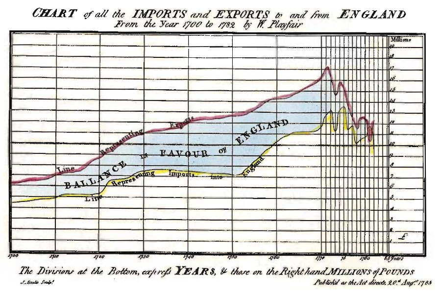
```

.footnote[ [1]Tilling, 1975 as cited in Tufte, 2007. ]


---

class: middle

> Information, that is imperfectly acquired, is generally imperfectly retained;
> and a man (*person*) who has carefully investigated **a printed table**, finds, when done, that (s)he has **only a very faint and partial idea** of what (s)he has read; and that like a figure imprinted on sand, is **soon totally erased and defaced**. [...] 

> On **inspecting any one of these Charts** attentively, a **sufficiently distinct impression** will be made, to **remain unimpaired for a considerable time**, and the idea which does remain will be **simple and complete** [...] 
> `r tufte::quote_footer('--- William Playfair in The Commercial and Political Atlas')`


---

class: middle

```{r, fig.align='center',out.width = "80%"}
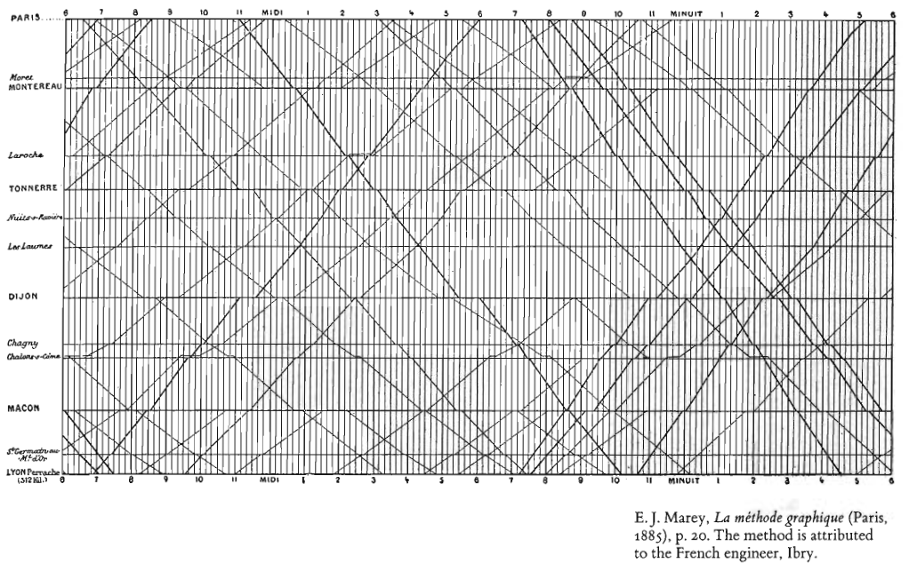
```


---
<br>
<br>
.center[
## Now, using R with the {ggplot2} package and the current Paris - Marseille schedule
] 
---
class: middle

```{r, fig.align='center',out.width = "80%"}
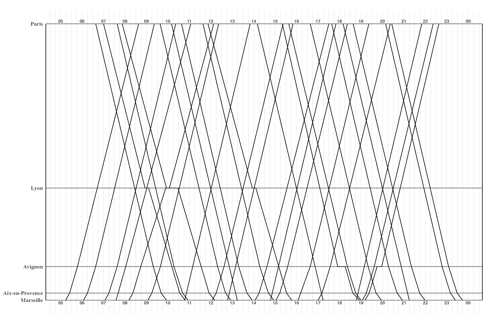
```


---

class: middle

```{r, fig.align='center',out.width = "80%"}
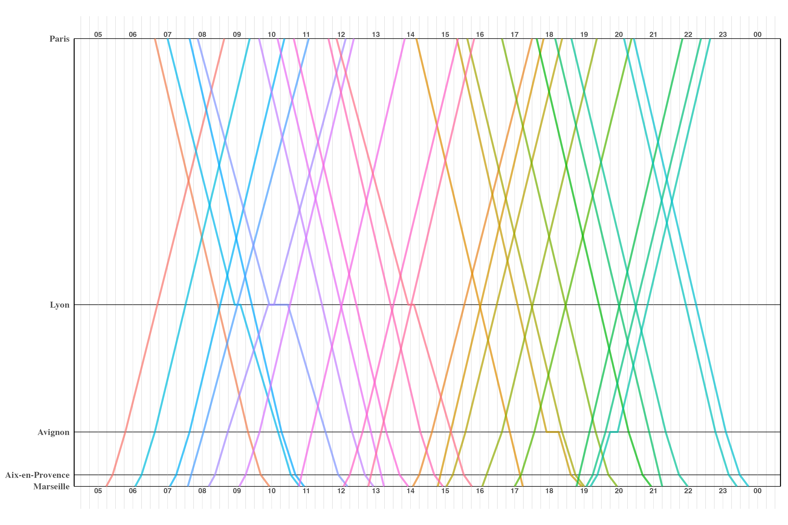
```


---

class: middle

```{r, fig.align='center',out.width = "80%"}
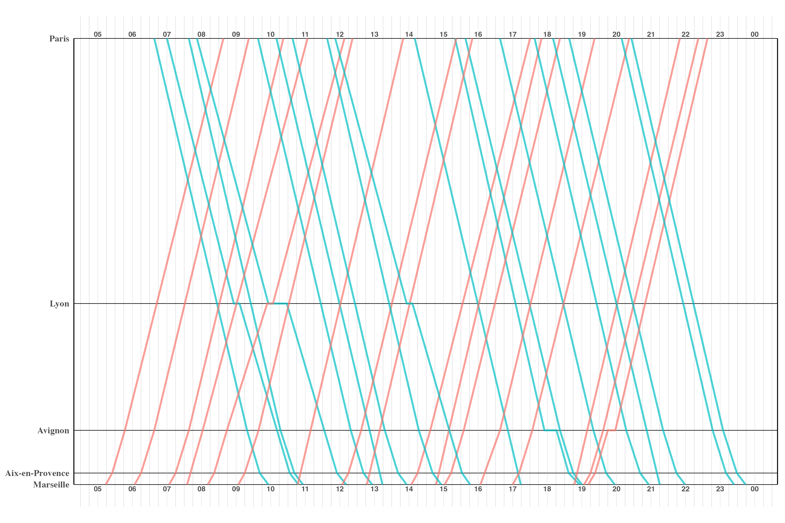
```


---


class: middle

```{r, fig.align='center',out.width = "80%"}
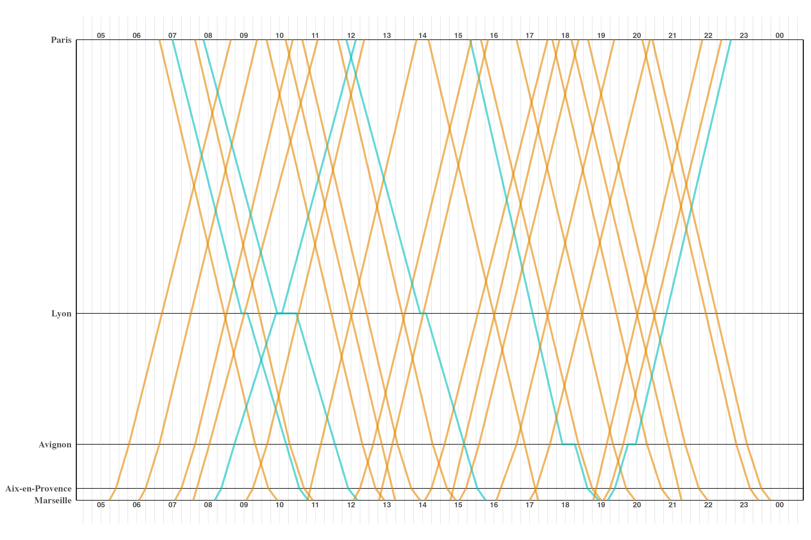
```


---
class: middle

```{r, fig.align='center',out.width = "80%"}
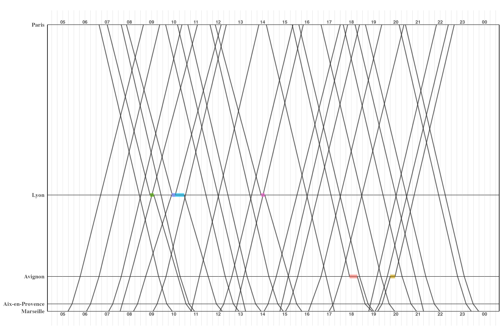
```


---
```{r, fig.align='center',out.width = "80%"}
knitr::include_graphics("https://cdn.myportfolio.com/45214904-6a61-4e23-98d6-b140f8654a40/9a306c0a-dac8-413d-ba2e-cc7fd4c4d5c8_rw_1920.png?h=c802991088a9623f1f7aa18c470797ee")
```


---
## PREPARING THE DATA FOR TODAY
We are going to use data from the [World Inequality Database](https://wid.world/).

```{r, echo = T, eval = F}
wid <- read.csv(here("data", "02_wid.csv"))
glimpse(wid)
```
```{r, echo = F, eval = T}
wid <- read.csv("../data/02_wid.csv")
glimpse(wid)
```

**What is the observation level? **
--
Country-year 
--
 
Variables:
- `fshare` Female labor income share
- `top1` Top 1% income share
- `inc_head` Income per capita (adults)


---
# ggplot() BASICS
.pull-left[
Based on *The Grammar of graphics* (Wilkinson, 2005).<br> What is a statistical graphic? A mapping from data to aesthetic attributes (color, shape, size) of geometric objects (points, lines, bars). 

  `ggplot()` creates a canvas to draw on. 

]
.pull-right[
```{r, echo = T, eval = F}
#install.packages("ggplot2")
library(ggplot2)


```
```{r, echo = T,  fig.width= 6, fig.height = 5}
ggplot()

```
]

---


---
# ggplot() BASICS
.pull-left[
Based on *The Grammar of graphics* (Wilkinson, 2005). <br> What is a statistical graphic? A mapping from data to aesthetic attributes (color, shape, size) of geometric objects (points, lines, bars). 

  `ggplot()` creates a canvas to draw on. Then we add: 

<span class="emphasized">🔢 🔡 Data:</span> specifies the dataframe with the **values** to plot
 


]
.pull-right[
```{r, echo = T, eval = F}
#install.packages("ggplot2")
library(ggplot2)

```

```{r, echo = T, eval = F, fig.width= 6, fig.height = 5}

ggplot(data = wid,          # Data
```

```{r, echo = F, eval = T, fig.width= 6, fig.height = 5}

ggplot(data = wid)         # Data
```

]

---
# ggplot() BASICS
.pull-left[
Based on *The Grammar of graphics* (Wilkinson, 2005). <br> What is a statistical graphic? A mapping from data to aesthetic attributes (color, shape, size) of geometric objects (points, lines, bars). 

  `ggplot()` creates a canvas to draw on. Then we add: 

<span class="emphasized">🔢 🔡 Data:</span> specifies the dataframe with the **values** to plot
 

<span class="emphasized">📐 🖌️Aesthetic mappings:</span > relate variables in the data to visual characteristics of the plot. 


]
.pull-right[
```{r, echo = T, eval = F}
#install.packages("ggplot2")
library(ggplot2)

```

```{r, echo = T, eval = F, fig.width= 6, fig.height = 5}

ggplot(data = wid,          # Data
       aes(x = inc_head,    # Aesthetics
           y = top1)) +
  
  
```

```{r, echo = F, eval = T, fig.width= 6, fig.height = 5}

ggplot(data = wid,          # Data
       aes(x = inc_head,    # Aesthetics
           y = top1)) 
  
  
```

]

---

# ggplot() BASICS
.pull-left[
Based on *The Grammar of graphics* (Wilkinson, 2005). <br> What is a statistical graphic? A mapping from data to aesthetic attributes (color, shape, size) of geometric objects (points, lines, bars). 

  `ggplot()` creates a canvas to draw on. Then we add: 

<span class="emphasized">🔢 🔡 Data:</span> specifies the dataframe with the **values** to plot
 

<span class="emphasized">📐 🖌️Aesthetic mappings:</span > relate variables in the data to visual characteristics of the plot. 


<span class="emphasized">📈 📊 Geometries:</span> describe how to render each observation. Can be layered to have multiple representations of the data.  
 


]
.pull-right[
```{r, echo = T, eval = F}
#install.packages("ggplot2")
library(ggplot2)

```

```{r, echo = T, eval = T, fig.width= 6, fig.height = 5}

ggplot(data = wid,          # Data
       aes(x = inc_head,    # Aesthetics
           y = top1)) +
  geom_point()              # Geometry
  
  
```

]

---


# ggplot() BASICS
.pull-left[
Based on *The Grammar of graphics* (Wilkinson, 2005). <br> What is a statistical graphic? A mapping from data to aesthetic attributes (color, shape, size) of geometric objects (points, lines, bars). 

  `ggplot()` creates a canvas to draw on. Then we add: 

<span class="emphasized">🔢 🔡 Data:</span> specifies the dataframe with the **values** to plot
 

<span class="emphasized">📐 🖌️Aesthetic mappings:</span > relate variables in the data to visual characteristics of the plot. 


<span class="emphasized">📈 📊 Geometries:</span> describe how to render each observation. Can be layered to have multiple representations of the data.  
 


]
.pull-right[
```{r, echo = T, eval = F}
#install.packages("ggplot2")
library(ggplot2)

```

```{r, echo = T, eval = T, fig.width= 6, fig.height = 5}

ggplot(data = wid,          # Data
       aes(x = inc_head,    # Aesthetics
           y = top1)) +
  geom_point()              # Geometry
  
  
```

]

---
## MAIN STRUCTURE

- Data and mapping should be specified in parentheses
- The first two arguments in `aes()` are almost always x,y 
- Geometry and other elements should be added with `+` 
```{r, echo = T, eval = F}
ggplot(wid, 
       aes(inc_head, top1)) +  
  geom_point()

```
--
<span class="emphasized"> Remember the pipe? </span> 
- We can also apply `ggplot()` to our data with the pipe `%>%` OR `|>`
--

```{r, echo = T, eval = F}
wid %>%                     # Data
ggplot(aes(x = inc_head,    # Aesthetics
           y = top1)) +
  geom_point()              # Geometry
```
---


### Can you guess the plots?
```{r, echo = T, eval = F }
wid %>% 
  ggplot(aes(top1, inc_head)) +
  geom_point()
```
--

```{r, echo = F, eval = T, fig.width= 10, fig.height = 6, fig.align='center'}
wid %>% 
  ggplot(aes(top1, inc_head)) +
  geom_point()
```
---
### Can you guess the plots?

```{r, echo = T, eval = F }
wid %>% 
  ggplot(aes(inc_head, fshare)) +
  geom_point()
```
--

```{r, echo = F, eval = T, fig.width= 10, fig.height = 6, fig.align='center' }
wid %>% 
  ggplot(aes(inc_head, fshare)) +
  geom_point()
```
---
### Can you guess the plots?

```{r, echo = T, eval = F }
wid %>% 
  filter(country == "Italy") %>% 
  ggplot(aes(year, fshare)) +
  geom_line()
```
--

```{r, echo = F, eval = T, fig.width= 10, fig.height = 6, fig.align='center' }
wid %>% 
  filter(country == "Italy") %>% 
  ggplot(aes(year, fshare)) +
  geom_line()
```
---
### Can you guess the plots?

```{r, echo = T, eval = F }
wid %>% 
  filter(year == "2010") %>% 
  ggplot(aes(inc_head)) +
  geom_histogram()
```
--

```{r, echo = F, eval = T, fig.width= 10, fig.height = 6, fig.align='center' }
wid %>% 
  filter(year == "2010") %>% 
  ggplot(aes(inc_head)) +
  geom_histogram()
```
---
# AESTHETICS:
.greenhead[**AXES**]
The quickest functions for the most common modifications:
.pull-left[

```{r, echo = T, eval = F}
wid %>% 
  ggplot(aes(inc_head, top1)) +
  geom_point() +
  xlab("Income per adult") + #<< 
  ylab("Income share among top 1%") + #<<
  xlim(0.2, 0.3) #<< 
  
```

```{r, echo = F, eval = T, warning=FALSE, fig.width= 8, fig.height = 5}
plot <-
  wid %>% 
  ggplot(aes(inc_head, top1)) +
  geom_point() 

plot +
  xlab("Income per adult") +
  ylab("Income share among top 1%") + #<<
  ylim(0.2, 0.3) + #<<
  theme_gray(base_size = 20) #<< 

```
]
.pull-right[
```{r, echo = T, eval = F}
wid %>% 
  ggplot(aes(inc_head, top1)) +
  geom_point() +
  xlab(NULL) + #<<
  ylab("") + #<<
  ylim(NA, 50000) #<<

```

```{r, echo = F, eval = T, warning=FALSE, fig.width= 8, fig.height = 5}

plot + 
  xlab(NULL) + 
  ylab("") +
  xlim(NA, 50000) +
    theme_gray(base_size = 20)

    # For continuous scales use NA to set only one limit 
  
```
]

---
# AESTHETICS
.greenhead[**THEME**]
- The theme system allows you to have control over the appearance of all the **non-data** elements of the plot
- You can use any of the **default R themes**. Also, you can specify the **font size** using `base_size` 

```{r, echo = T, eval = F}
... +
  theme_gray(base_size = 10) #<< # The default theme 
```

--

```{r, out.width="25%"}
par(mar = c(1, 4, .1, .1))
plot <- wid %>% 
  ggplot(aes(inc_head, top1)) +
  geom_point() 
plot + theme_minimal(base_size =20) + ggtitle("theme_minimal()")
plot + theme_bw(base_size =30) + ggtitle("theme_bw()")
plot + theme_dark(base_size =40)  + ggtitle("theme_dark()")
plot + theme_void(base_size = 45) + ggtitle("theme_void()")
```
--

- You can customize the graph completely using the theme() function
- See `?theme` for the endless possibilities and [Chapter 8 of Wickham (2016)](https://ggplot2-book.org/themes)


  
---
# AESTHETICS .greenhead[**GEOM ATTRIBUTES**] 

We can set the appearance of our observations by specifying their shape, color, fill, size/width, and transparency (*alpha*). 
**Aesthetic attributes can make or break a plot:** 
```{r, eval = F, echo = T, results = F}
df <- data.frame(x = rnorm(15000), y = rnorm(15000))
norm <-
  df %>% 
  ggplot(aes(x,y)) 

norm + geom_point()
```

```{r, echo = F, results = T, fig.show="hold", fig.align = 'center', out.width="28%"}
par(mar = c(3, 3, .1, .1))

df <- data.frame(x = rnorm(15000), y = rnorm(15000))

norm <-
  df %>% 
  ggplot(aes(x,y)) +
  xlab(NULL) + ylab(NULL) 

norm + geom_point()

```
---
### How to deal with overplotting? 

<span class="emphasized">Changing the size</span>

```{r, echo = T, results = T, fig.show="hold", out.width="33%"}
par(mar = c(3, 3, .1, .1))

norm + geom_point(size = 3)
norm + geom_point(size = 2)
norm + geom_point(size = 1)
```
---

### How to deal with overplotting? 
<span class="emphasized">Changing the shape</span>
```{r, echo = T, results = T, fig.show="hold", out.width="33%"}
par(mar = c(3, 3, .1, .1))

norm + geom_point(size =3)
norm + geom_point(size = 3,
                  shape = 1) #<< 
norm + geom_point(size = 3,
                  shape = "X") #<< 
```
See `vignette("ggplot2-specs")`for the values you can use for these and other aesthetics

---

### How to deal with overplotting? 

<span class="emphasized">Changing the transparency</span>

```{r, echo = T, results = T, fig.show="hold", out.width="33%"}
par(mar = c(3, 3, .1, .1))

norm + geom_point(size = 3)
norm + geom_point(size = 3,
                  alpha = 1 / 2) #<< 
norm + geom_point(size = 3,
                  alpha = 0.1) #<< 

```


---

## ADDING DIMENSIONS
So far, we've added at most two variables to our plots. 

We can add more variables using aesthetics like the **color, shape, and size** of the geometries. 
.pull-left[

```{r, echo = T, eval = F}
wid %>% 
  ggplot(aes(inc_head, top1,
             color = continent)) + #<< 
  geom_point()
```

```{r, echo = F, eval = T, fig.width= 8, fig.height = 5}
wid %>% 
  ggplot(aes(inc_head, top1,
             color = continent)) + #<< 
  geom_point() +
  theme_gray(base_size = 20)
```
]
.pull-right[
]
---

## ADDING DIMENSIONS
So far, we've added at most two variables to our plots. 

We can add more variables using aesthetics like the **color, shape, and size** of the geometries. We are **mapping** variable values into visual attributes. 
.pull-left[

```{r, echo = T, eval = F}
wid %>% 
  ggplot(aes(inc_head, top1,
             color = continent)) + #<< 
  geom_point()
```

```{r, echo = F, eval = T, fig.width= 8, fig.height = 5}
wid %>% 
  ggplot(aes(inc_head, top1,
             color = continent)) + #<< 
  geom_point() +
  theme_gray(base_size = 20)
```
]
.pull-right[
- ggplot2 takes care of the details converting data ("Europe", "Africa") to aesthetics (Green, Red) with an automatic **scale** 

- When our mapping variable is continuous, a gradient is used instead

- The scale can be overridden and customized. [See Chapter 6 of ggplot2 book for more details.  ](https://ggplot2-book.org/scales-colour)
  - `scale_color_discrete()`
  - `scale_color_manual(values = c("red", "blue","#000000"))`

]
---
## ADDING DIMENSIONS

```{r, echo = T, eval = F, fig.width = 10, fig.height = 5, fig.align='center'}
wid %>% 
  ggplot(aes(inc_head, top1,
             color = fshare)) + #<< 
  geom_point(alpha = 0.3)
```
```{r, echo = F, fig.width = 10, fig.height = 5.5, fig.align='center'}
wid %>% 
  ggplot(aes(inc_head, top1,
             color = fshare)) + #<< 
  geom_point(alpha = 0.3,
             size = 3) +
  theme_gray(base_size = 20)
```

---
##Setting vs. mapping visual attributes
.pull-left[
.nunito[**Setting:**] Defining a **fixed** value
```{r, echo = T, eval = F, fig.width = 8}
wid %>% 
  ggplot(aes(inc_head, top1)) +
  geom_point(color = "darkblue")
```
```{r, echo = F, fig.width = 8, fig.height = 5}
wid %>% 
  ggplot(aes(inc_head, top1)) +
  geom_point(color = "darkblue") +
  theme_grey(base_size = 20)
```
]
.pull-right[
.nunito[**Mapping:**] Relating an aesthetic to a **variable**  

```{r, echo = T, eval = F}
wid %>% 
  ggplot(aes(inc_head, top1,
             color = continent)) + #<<
  geom_point()
```

```{r, echo = T, eval = F, results = T, fig.width = 8}
# Equivalent to this: 
wid %>% 
  ggplot(aes(inc_head, top1)) +
  geom_point(aes(color = continent)) #<<
```
```{r, echo = F, results = T, fig.width = 8, fig.height = 4}
# Equivalent to this: 
wid %>% 
  ggplot(aes(inc_head, top1)) +
  geom_point(aes(color = continent)) +
  theme_grey(base_size = 20)
```
]
---
### What about this? 

.pull-left[
<br> 
```{r, echo = T, eval = F}
wid %>% 
  ggplot(aes(inc_head, top1)) +
  geom_point(aes(color = "darkblue")) #<< 
```

```{r, echo = F, fig.width = 8, fig.height= 6}
wid %>% 
  ggplot(aes(inc_head, top1)) +
  geom_point(aes(color = "darkblue")) +
  theme_grey(base_size = 20)
```

]

.pull-left[
]

---

### What about this? 

.pull-left[
<br> 
```{r, echo = T, eval = F}
wid %>% 
  ggplot(aes(inc_head, top1)) +
  geom_point(aes(color = "darkblue")) #<< 
```

```{r, echo = F, fig.width = 8, fig.height= 6}
wid %>% 
  ggplot(aes(inc_head, top1)) +
  geom_point(aes(color = "darkblue")) +
  theme_grey(base_size = 20)
```

]

.pull-left[
- This is mapping the value "dark blue" to a color.

- It temporarily creates a new variable containing only the value "darkblue" and then scales it with a color scale.


```{r, echo = T, eval = F}
wid %>% 
  mutate(colour = "darkblue") %>% 
  ggplot(aes(inc_head, top1,
             color = colour)) +
  geom_point() 
```

- We'll learn how it can be useful in a few slides

]

---
### FACETTING


.pull-left[
- Another technique for displaying additional categorical variables on a plot is facetting.

```{r, echo = T, eval = F, out.height= "20%", out.width= "50%"}
wid %>% 
  ggplot(aes(inc_head, top1)) +
  geom_point(alpha = 0.3) +
  facet_wrap(~continent)
  
```
- It creates tables of plots by splitting the data into subsets and displaying different graphs for each subset

]
.pull-right[

```{r, echo = F, eval = T, fig.width= 8, fig.height = 9}
wid %>% 
  ggplot(aes(inc_head, top1)) +
  geom_point(alpha = 0.3) +
  facet_wrap(~continent) + #<< +
  theme_grey(base_size = 20)
  
```
]


---
### FACETTING


.pull-left[
- Another technique for displaying additional categorical variables on a plot is facetting.

```{r, echo = T, eval = F, out.height= "20%", out.width= "50%"}
wid %>% 
  ggplot(aes(inc_head, top1)) +
  geom_point(alpha = 0.3) +
  facet_wrap(~continent)
  
```
- It creates tables of plots by splitting the data into subsets and displaying different graphs for each subset

- Choose the facet arrangement using `nrow` and `ncol` to indicate the number of rows and columns
- Specify the type of scale you want:
  - **free**: adjusted separately to each facet
  - **fixed**: common to all 
]
.pull-right[

```{r, echo = F, eval = T, fig.width= 8, fig.height = 9}
wid %>% 
  ggplot(aes(inc_head, top1)) +
  geom_point(alpha = 0.3) +
  facet_wrap(~continent) + #<< +
  theme_grey(base_size = 20)
  
```
]


---
### FACETTING

```{r, echo = T, eval = F, fig.width = 13, fig.height =5}
wid %>% 
  ggplot(aes(inc_head, top1)) +
  geom_point(alpha = 0.3) +
  facet_wrap(~continent,
             ncol = 6, #<<
             scales = "free_x") #<<
  
```
```{r, echo = F, eval = T, fig.width = 15, fig.height =5}
wid %>% 
  ggplot(aes(inc_head, top1)) +
  geom_point(alpha = 0.3) +
  facet_wrap(~continent,
             ncol = 6, #<<
             scales = "free_x") + #<<
  theme_grey(base_size = 20)
  
```
---
<br>
<br>
## SAVING 
- `ggsave()` will save what is in the plot panel

```{r, echo = T, eval = F}
ggsave(here("outputs", "myplot.png")   # Saves what is in the Plots tab

ggsave(here("outputs", "myplot.png"),    # Where 
       plot = last_plot(), # What 
       width = 16,         # Dimensions
       height = 9,
       unit = "cm")        # Units

```
---
# AGENDA
.nunitosm[

.pull-left[
.nunitosmgrey[
- AN INTRO TO DATA VISUALIZATION

- THE ggplot() FUNCTION
  1. MAIN STRUCTURE
  2. AESTHETICS 
  3. ADDING DIMENSIONS
  4. MAPPING vs. SETTING ATTRIBUTES
  5. SAVING
]
]

.pull-right[

- BROWSING THE TOOLBOX
  1. ADDING LAYERS
  2. LABELS
  3. ANNOTATIONS
  4. GROUPING DATA
  5. STATISTICAL SUMMARIES
  
- WHICH GRAPH SHOULD I USE?
- GRAPHICAL EXCELLENCE AND INTEGRITY

]
 ]
---

### BROWSING THE TOOLBOX
There is a lot. Really **A LOT** you can do with ggplot. 
<br> Let's illustrate these tools creating a `ggplot()` modern version of one of Playfair's trade balance graphs: <br> - Download and import `02_playfair-balance.csv`

```{r, out.width = "65%", fig.align='center'}
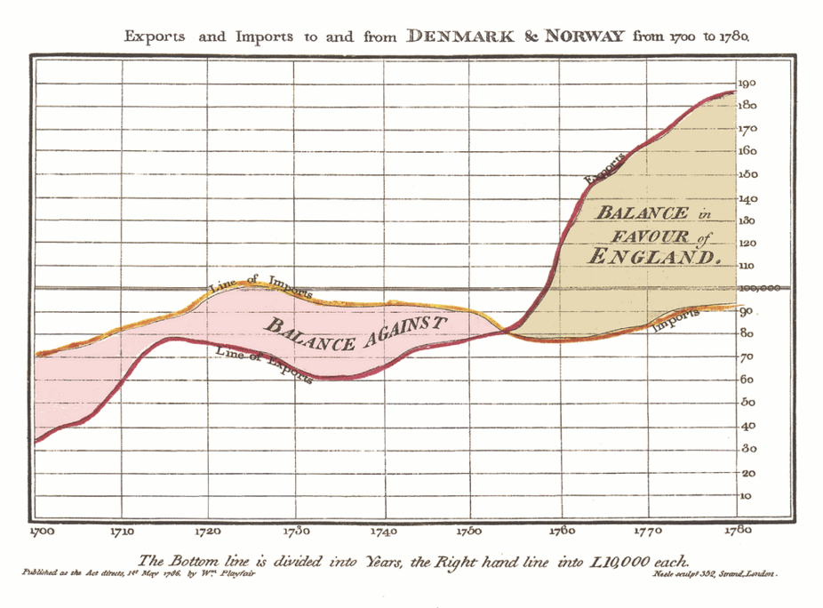
```

---
### ADDING MORE LAYERS
.pull-left[
We can keep on adding geometries and geometries to build our dataset.
- Every layer we add must have some data associated with it 
- The data on each layer doesn't need to be the same. We can specify the mappings/aesthetics of each geom (data, x, y) separately. 
  - When a new geom is added it inherits the aesthetics inside `ggplot(aes())` unless specified otherwise
  - It doesn't hurt to be explicit about which data you are using when you are handling multiple layers    
]
 
.pull-right[
```{r, echo = T, fig.align='center', out.width = "80%"}
balance <- read.csv("../data/raw/02_playfair-balance.csv") 
```

```{r, echo = T, fig.width= 8, fig.height = 5}
balance %>% 
  ggplot(aes(x = year, y = exports)) + 
  geom_line(aes(y = exports),      # First layer #<<
            color = "red") +
  geom_line(aes(y = imports),      # Second layer #<< 
            color = "orange") + 
  theme_minimal(base_size = 20) 
```
]


---

```{r, echo = T, fig.width= 10, fig.height = 5}
balance %>% 
  ggplot(aes(x = year, y = exports)) + 
  geom_line(aes(y = exports),      # First layer #<<
            color = "red") +
  theme_minimal(base_size = 20) 


```
---

```{r, echo = T, fig.width= 10, fig.height = 5}
balance %>% 
  ggplot(aes(x = year, y = exports)) + 
  geom_line(aes(y = exports),      # First layer #<<
            color = "red") +
  geom_line(aes(y = imports),      # Second layer #<< 
            color = "gold") + 
  theme_minimal(base_size = 20) 
```
---

.nunito[What happens if we don't specify new mappings for each geom?]
```{r, echo = T, fig.width= 10, fig.height = 5}
balance %>% 
  ggplot(aes(x = year, y = exports)) + 
  geom_line(color = "red") +
  geom_line(color = "gold") + 
  theme_minimal(base_size = 20) 

```
---
### LABELING EACH LAYER
```{r, echo = T, fig.width= 10, fig.height = 5, fig.align='center'}
  balance %>% 
    ggplot(aes(x = year, y = exports)) + 
    geom_line(aes(y = exports,
                  color = "Exports")) +   #<<
    geom_line(aes(y = imports,
                  color = "Imports")) +     #<<
    theme_minimal() +
  scale_color_manual(values = c("red", "orange"),
                     name = NULL)
```
---


Let's save this plot to add more things to it later: 
```{r, echo = T}
balance_plot <- #<<
  balance %>% 
    ggplot(aes(x = year, y = exports)) + 
    geom_line(aes(y = exports,
                  color = "Exports")) +   
    geom_line(aes(y = imports,
                  color = "Imports")) +     
    theme_minimal() +
  scale_color_manual(values = c("red", "orange"),
                     name = NULL)
```
---

## LABELS

- Adding text to a plot. Your obvious best friend: `geom_text()`. Same as `geom_point()`but with text labels instead of points. Duh 🙄

For example, with our WID data:
```{r, echo = T, eval = F}
wid %>% 
  filter(year == 2019 & continent == "Europe") %>% 
  ggplot(aes(x = inc_head, y = top1)) +
  geom_text(aes(label = country), #<< 
            alpha = 0.7)

```


```{r, echo = F, eval = T, fig.width=9, fig.height=4, align = 'center'}
wid %>% 
  filter(year == 2019 & continent == "Europe") %>% 
  ggplot(aes(x = inc_head, y = top1)) +
  geom_text(aes(label = country), #<< 
            alpha = 0.7,
            size = 4) +
  theme_grey(base_size = 20)

```
---


### LABELS 
Now, using it with our trade balance plot to highlight three points:
```{r, echo = T}
bal_labels <- # Keep only the data for three years 
  balance %>% 
  filter(year %in% c(1702, 1740, 1764)) 
```
--
```{r, echo = T, eval = F, out.width = "50%"}
balance_plot + 
  geom_point(data = bal_labels) +  #<< 
  geom_text(aes(x = year, y = exports,
                label = exports), 
            data = bal_labels) #<< 
```
```{r, echo = F, fig.width = 11, fig.height= 5, fig.align ='center'}
balance_plot + 
  geom_point(data = bal_labels) + 
  geom_text(aes(x = year, y = exports,
                label = exports), 
            data = bal_labels) + #<< 
  theme_minimal(base_size = 20)
```


---


Fixing things:
```{r, echo = T, eval = F }
bal_labels <- 
  balance %>% 
  filter(year %in% c(1702, 1740, 1764)) # Keep only these
```
```{r, echo = T, eval = F, out.width = "50%"}
balance_plot + 
  geom_point(data = bal_labels) + 
  geom_text(aes(x = year, y = exports,
                label = exports), 
            data = bal_labels, 
            nudge_y = 4, #<<
            nudge_x = -2) #<<
```
```{r, echo = F,  fig.width = 11, fig.height= 5, fig.align ='center'}
balance_plot + 
  geom_point(data = bal_labels) + 
  geom_text(aes(x = year, y = exports,
                label = exports), 
            data = bal_labels, 
            nudge_y = 5, #<<
            nudge_x = -2) + #<<
    theme_minimal(base_size = 20)

```

---
### ANNOTATIONS
- Annotations add metadata to your plot to **highlight** certain features. You can use:

  - `geom_text()` to add text descriptions or label points (ex. outliers). 
  
  - `geom_rect()` to highlight rectangular regions of the plot
  
  - `geom_line()`, `geom_path()`, `geom_segment()` to add lines 
  
  - `geom_vline()`, `geom_hline()` to add rulers (lines that span the whole graph)
  
---
### ANNOTATIONS
.pull-left[

```{r, echo = T, eval = F}
balance_plot +
  geom_vline(xintercept = 1707,
             linetype = "dashed") 
    
```
<br>
<br>
```{r, echo = F}
balance_plot +
  geom_vline(xintercept = 1707,
             linetype = "dashed") +
  theme_minimal(base_size = 20)
    
```
]
.pull.right[

```{r, echo = T, eval = F}
balance_plot +
  geom_vline(xintercept = 1707,
             linetype = "dashed") +
  annotate("text", x = 1716, y = 150, 
           label = "Acts of Union between \n England and Scotland")
    
```

```{r, echo = F, eval = T}
balance_plot +
  geom_vline(xintercept = 1707,
             linetype = "dashed") +
  annotate("text", x = 1726, y = 150, 
           label = "Acts of Union between \n England and Scotland") +
  theme_minimal(base_size = 20)
    
```
] 
---
class: inverse
### EXERCISE 

- Reproduce this graph with the Taylor Swift data.  Hint: add `scale_shape_manual(values = c(1, 16))` at the end. 
<br> 
```{r, fig.retina = 2, fig.width= 15, fig.height= 7, echo = F, results = F}
ts %>% 
  ggplot(aes(x = popularity, y = album,
             shape = as.factor(is_taylors_version),
             alpha = danceability)) +
  geom_point(size = 6) +
  theme_minimal(base_size = 20) +
  scale_shape_manual(values = c(15, 16)) +
  theme(legend.position="bottom")

```
`r countdown(minutes = 10, seconds = 0)`


---
```{r, fig.show = 'hide', echo = T}
ts %>% 
  ggplot(aes(x = popularity, y = album))
                                                                                  #
                                                                                  #
                                                                                  #
                                                                                  #
                                                                                  #
                                                                                  #
                                                                                  #

```

```{r, fig.retina = 2, fig.width= 15, fig.height= 6, echo = F}
ts %>% 
  ggplot(aes(x = popularity, y = album)) +
    theme_grey(base_size = 20) 

```

---
```{r, fig.show = 'hide', echo = T}
ts %>% 
  ggplot(aes(x = popularity, y = album)) + 
  geom_point(size = 6) 
                                                                                  #
                                                                                  #
                                                                                  #
                                                                                  #
                                                                                  #
                                                                                  #

```

```{r, fig.retina = 2, fig.width= 15, fig.height= 6, echo = F}
ts %>% 
  ggplot(aes(x = popularity, y = album)) +
  geom_point(size = 6) +
  theme_grey(base_size = 20) 
```
---


```{r, fig.show = 'hide', echo = T}
ts %>% 
  ggplot(aes(x = popularity, y = album,
             shape = as.factor(is_taylors_version),
             alpha = danceability)) + 
  geom_point(size = 6) 
                                                                                  #
                                                                                  #
                                                                                  #
                                                                                  #

```

```{r, fig.retina = 2, fig.width= 15, fig.height= 6, echo = F}
ts %>% 
  ggplot(aes(x = popularity, y = album,
             shape = as.factor(is_taylors_version),
             alpha = danceability)) +
  geom_point(size = 6) +
  theme_grey(base_size = 20) 
```
---
```{r, fig.show = 'hide', echo = T}
ts %>% 
  ggplot(aes(x = popularity, y = album,
             shape = as.factor(is_taylors_version),
             alpha = danceability)) + 
  geom_point(size = 6) +
  scale_shape_manual(values = c(15, 16)) 
                                                                                  #
                                                                                  #
                                                                                  #

```

```{r, fig.retina = 2, fig.width= 15, fig.height= 6, echo = F}
ts %>% 
  ggplot(aes(x = popularity, y = album,
             shape = as.factor(is_taylors_version),
             alpha = danceability)) +
  geom_point(size = 6) +
  theme_grey(base_size = 20) +
  scale_shape_manual(values = c(15, 16)) 
```
---
```{r, fig.show = 'hide', echo = T}
ts %>% 
  ggplot(aes(x = popularity, y = album,
             shape = as.factor(is_taylors_version),
             alpha = danceability)) + 
  geom_point(size = 6) +
  scale_shape_manual(values = c(15, 16)) +
  theme_minimal(base_size = 20) 
                                                                                  #
                                                                                  #

```

```{r, fig.retina = 2, fig.width= 15, fig.height= 6, echo = F}
ts %>% 
  ggplot(aes(x = popularity, y = album,
             shape = as.factor(is_taylors_version),
             alpha = danceability)) +
  geom_point(size = 6) +
  theme_minimal(base_size = 20) +
  scale_shape_manual(values = c(15, 16))
```
---
```{r, fig.show = 'hide', echo = T}
ts %>% 
  ggplot(aes(x = popularity, y = album,
             shape = as.factor(is_taylors_version),
             alpha = danceability)) + 
  geom_point(size = 6) +
  scale_shape_manual(values = c(15, 16)) +
  theme_minimal(base_size = 20) + 
  theme(legend.position = "bottom") 
                                                                                  #

```

```{r, fig.retina = 2, fig.width= 15, fig.height= 6, echo = F}
ts %>% 
  ggplot(aes(x = popularity, y = album,
             shape = as.factor(is_taylors_version),
             alpha = danceability)) +
  geom_point(size = 6) +
  theme_minimal(base_size = 20) +
  scale_shape_manual(values = c(15, 16)) +
  theme(legend.position = "bottom") 
```


---
### Statistical summaries
So far, we've only seen **individual geoms**, where there is a graphical object drawn for each observation (e.g. `geom_point()` draws one point per row)

A **collective geom** displays multiple observations with one geometric object. They are often used to display grouped summary statistics (e.g. the average popularity by album) or variable distributions through boxplots or histograms/densities. 

.pull-left[
```{r, echo = F, fig.retina = 2, fig.width= 8, fig.height= 5}
ts %>% 
  # Create summary statistic
  group_by(album) %>% 
  summarise(popularity = mean(popularity)) %>% 
  # Plot
  ggplot(aes(x = album, y = popularity)) +
  geom_bar(stat = "identity") + 
    theme_grey(base_size = 20) + 
  theme(axis.text.x = element_text(angle = -40, vjust = 1, hjust = 0))  #Rotate axis labels  #<< 
```
]
.pull-right[
```{r, echo = T, fig.retina = 2, fig.show='hide'}
ts %>% 
  # Create summary statistic
  group_by(album) %>% 
  summarise(popularity = 
              mean(popularity)) %>% 
  # Plot
  ggplot(aes(x = album, 
             y = popularity)) +
  geom_bar(stat = "identity") + 
  # Rotate axis labels 
  theme(axis.text.x = 
          element_text(angle = -40, 
                       vjust = 1, 
                       hjust = 0))   
```
]
---

### Statistical summaries
So far, we've only seen **individual geoms**, where there is a graphical object drawn for each observation (e.g. `geom_point()` draws one point per row)

A **collective geom** displays multiple observations with one geometric object. They are often used to display grouped summary statistics (e.g. the average popularity by album) or variable distributions through boxplots or histograms/densities. 

.pull-left[
```{r, echo = F, fig.retina = 2, fig.width= 8, fig.height= 6}
ts %>% 
  filter(!is.na(album)) %>% 
  ggplot(aes(x = album, y = popularity)) +
  geom_violin(fill = "lightblue",
              alpha = 0.5) + 
  geom_boxplot(width = .1,
               alpha = 0.4) +
  theme_grey(base_size = 20) + 
  theme(axis.text.x = element_text(angle = -40, vjust = 1, hjust = 0))
```

]
.pull-right[
```{r, echo = T, fig.retina = 2, fig.show='hide'}
ts %>% 
  filter(!is.na(album)) %>% 
  ggplot(aes(x = album, 
             y = popularity)) +
  geom_violin(fill = "lightblue",
              alpha = 0.5) + 
  geom_boxplot(width = .1,
               alpha = 0.4) 
```
]
---
## HOW TO CHOOSE THE RIGHT PLOT?
- **Do you want to see all the observations or summarize the data?**

- **Are your x and y categorical or continuous?** See the recommendations in the [ggplot2 cheatsheet](https://github.com/rstudio/cheatsheets/blob/main/data-visualization.pdf) or this [decision tree by Yan Holtz & Conor Healy](https://www.data-to-viz.com/)

--

<br> 
Look into visualization galleries: 
- [The R graph ghallery](https://r-graph-gallery.com/) for examples of use cases and inspiration on aesthetics

- [50 ggplot2 visualizations with R code](http://r-statistics.co/Top50-Ggplot2-Visualizations-MasterList-R-Code.html)

- Examples from economics research from DIME Analytics [Econ Visual Library in R](https://worldbank.github.io/r-econ-visual-library/index.html) and [Stata](https://worldbank.github.io/stata-visual-library/)

<br> 
--
 **BEST RESOURCE** for everything related to ``ggpplot()`
- [ggplot2: Elegant Graphics for Data Analysis by Haldey Wickham](https://ggplot2-book.org/).

---

```{r, include = FALSE}

balance %>% 
  mutate(balance = exports - imports) %>% 
  ggplot(aes(x = year, y = imports)) +
  geom_area(aes(y = imports), stat = "identity",
            alpha = 0.3,
            fill = "red") +
  geom_area(aes(y = exports), stat = "identity",
            alpha = 0.3,
            fill = "gold") +
  geom_line(aes(y = imports),
            color = "gold") + 
  geom_line(aes(y = exports),
            color = "red") + 
  geom_text(x = 1730, y = 80, 
            label = "BALANCE AGAINST",
            size = 2.5) + 
  geom_text(x = 1770, y = 130, 
            label = "BALANCE IN \n FAVOUR OF \n ENGLAND",
            size = 2.5) +
  scale_x_continuous(breaks = c(seq(1700, 1780, 10)),
                     name = "The bottom line is divided into Years, 
                              the right hand line into L10,000 each") +
  scale_y_continuous(breaks = c(seq(10, 190, 10)),
                     name = NULL) + 
  theme_minimal()

  geom_area(aes(y = balance))

```

---

### GRAPHICAL EXCELLENCE 
.greenhead[4 qualities of great visualizations]

.nunito[**1. HONEST**]
```{r, out.width = "50%", fig.align='center'}
knitr::include_graphics("./inputs/02_tesla-netflix-stock.png")
```
--

Being careless with scales and axes is dangerous 
  - Zooming or unzooming the graphs can be very misleading. Start your axis at 0 (most of the time).
  - Double axes can say whatever you want them to say. Plot things on the same scale.


---
.greenhead[4 qualities of great visualizations]

.nunito[**2. FUNCTIONAL**]

- Your graph should convey information right but also **help the audience interpret the data correctly** - 
- It should be understood without additional context (label axes and add proper legends)
.pull-left[
<br>
<br>
<br>
```{r, out.width = "100%", fig.align='center'}
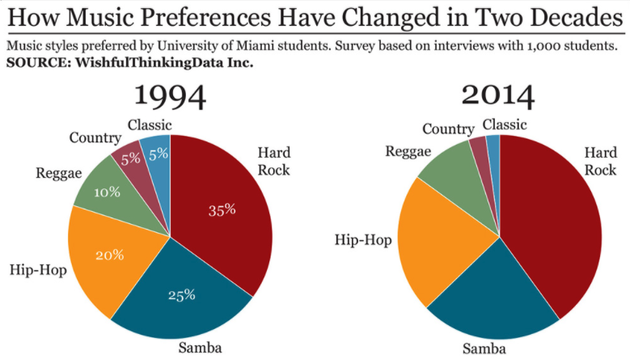
```
]

.pull-right[
```{r, out.width = "60%", fig.align='center'}
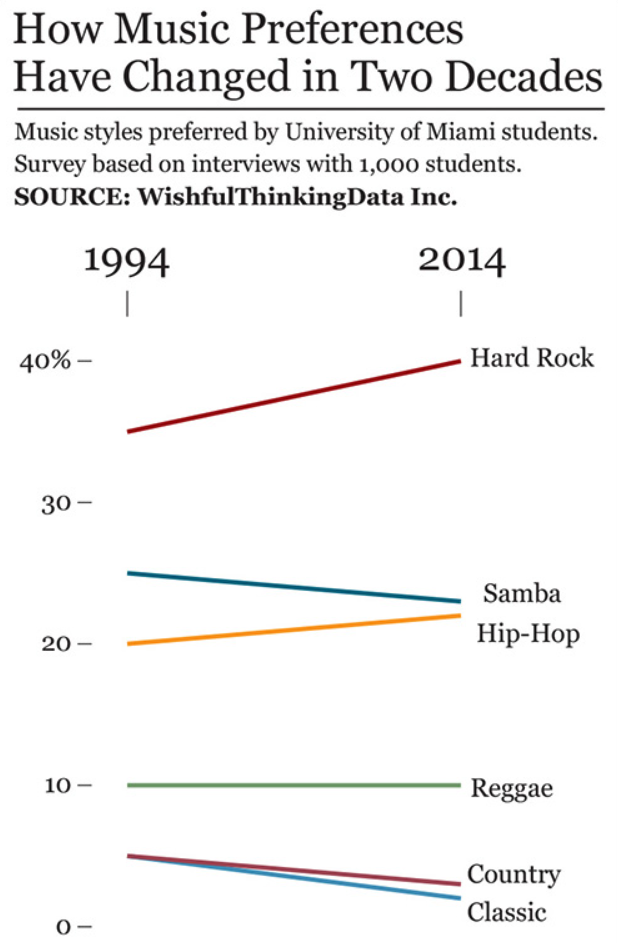
```
]

---


---


.greenhead[4 qualities of great visualizations]

.nunito[**3. BEAUTIFUL**]

- Your graph should be attractive and **✨aesthetically pleasing✨**. Declutter!  

```{r, echo = F, fig.retina = 2, fig.width= 20, fig.height= 8, fig.align='center'}
wid %>% 
  filter(country %in% c("USA", "Brazil", "China", 
                        "United Kingdom", "Netherlands", "Germany")) %>% 
   ggplot(aes(x = round(year), y = top1,
              group = country,
              color = country)) + 
  geom_line(aes(y = top1 + .002),
            linewidth = 1) +
    geom_line(aes(y = top1 - .002),
            linewidth = 1) +
    geom_line(aes(y = top1),
            linewidth = 0.5,
            color = "white") +
    geom_point(shape = 18,
             size = 8) +
  theme_grey(base_size = 25) +
  scale_x_continuous(breaks = c(2010:2019),
                     name = "Year") +
  scale_y_continuous(breaks = seq(0, .3, .025),
                     limits = c(0, .3),
                     name = "Income share of top 1%") +
  scale_color_manual(values = c("red", "blue", "orange",
                                "darkgreen", "darkgrey", "purple"))
```
---
.greenhead[4 qualities of great visualizations]

.nunito[**3. BEAUTIFUL**]

- Your graph should be attractive and **✨aesthetically pleasing✨**. Declutter!  

```{r, echo = F, fig.retina = 2, fig.width= 20, fig.height= 8, fig.align='center'}
wid %>% 
  filter(country %in% c("USA", "Brazil", "China", 
                        "United Kingdom", "Netherlands", "Germany")) %>% 
   ggplot(aes(x = round(year), y = top1,
              group = country,
              color = country)) + 
  geom_point(size = 8) +
  geom_line(linewidth = 2) +
  theme_classic(base_size = 25) +
  scale_color_discrete(name = NULL) +
  scale_x_continuous(breaks = seq(2010,2019, 2),
                     name = "Year") +
  scale_y_continuous(breaks = seq(0, .3, .05),
                     limits = c(0, .3),
                     name = "Income share of top 1%")
```

---

.greenhead[4 qualities of great visualizations]

.nunito[**4. INSIGHTFUL**]
- A graphic should reveal evidence that we would have a hard time seeing otherwise. The purpose of visualization is insight, not pictures.
- From the creators of "*meetings that could have been an e-mail*", we have: "*graphs that could have been a simple table or sentence*" 

```{r, fig.retina = 2, fig.width= 8, fig.height= 5, fig.align='center'}
wid %>% 
  filter(country == "USA" &
           year %in% c(2010, 2018)) %>% 
  ggplot(aes( x = year, y = fshare,
              fill = country)) + 
  geom_bar(stat = "identity") +
  geom_text(aes(y = fshare + .02,
                label = round(fshare, 3))) + 
  theme_classic(base_size = 25) +
  ylab("Female labor share") 

```

---

###HOMEWORK
Submit using [this](https://classroom.github.com/a/VrRecub6) link
- Use the `02_playfair-wages-wheat,csv` dataset and  and replicate this graph as best as you can using `ggplot()`
```{r, out.width = "50%", fig.align='center'}
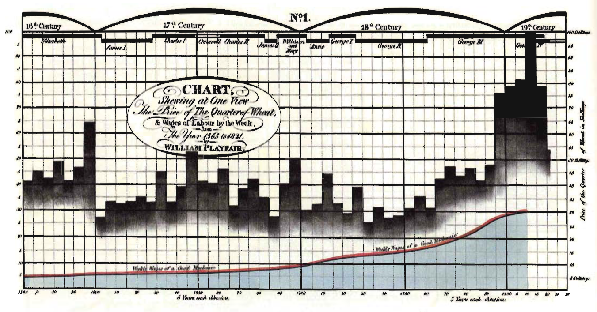
```
  - 🆗 OK: Plotting wheat prices, wages and the timeline of English rulers in the right geoms and colors
  - 👍🏽 Great: Getting the axes (you might need `dup_axis()`) and the overall appearance of the geoms as similar as you can, as well as including the annotation in the middle of the graph ("Chart showing...")
  - 🤩 Amazing: Adding the label over the wages series ("Weekly wages of a good mechanic"), customizing the appearance of the grid and including the labels of the English rulers 
  

---

###HOMEWORK
Submit using [this](https://classroom.github.com/a/VrRecub6) link
- Use the `02_playfair-wages-wheat,csv` dataset and  and replicate this graph as best as you can using `ggplot()`
```{r, out.width = "50%", fig.align='center'}

```


After completing this or after at least **30 minutes of trying on your own** — you may use an AI tool (e.g., ChatGPT) to get help. Add a short reflection at the bottom of your script:

1. What prompt did you give to the AI? (Paste it)
2. What kind of answer did it give you? Was it helpful? Why or why not?
3. How did you adapt or modify what the AI gave you, if at all?

Include your R script (with AI reflection) and final image 
---


### SLIDES THAT DIDN'T MAKE THE CUT

- Axes can be modified with **scale functions**. The following parameters can be specified:
  - `name` the label of the axis
  - `limits` where the axis starts and ends
  - `breaks` where to put ticks and values on the axis 
  
.pull-left[
```{r, eval = F, echo = T}
wid %>% 
  ggplot(aes(inc_head, top1)) +
  geom_point() +
  
#  
```
]
.pull-right[
```{r, eval = F, echo = T}
wid %>% 
  ggplot(aes(inc_head, top1)) +
  geom_point() +
  scale_x_continuous() + 
  scale_y_continuous()
  
```
]


---
## Axes
```{r, eval = F, echo = T}
wid %>% 
  ggplot(aes(inc_head, top1)) +
  geom_point() 


                                                      #
```
```{r, echo = F, fig.height= 4, out.width="60%"}
wid %>% 
  ggplot(aes(inc_head, top1)) +
  geom_point() 
```
---
## Axes
```{r, eval = T, echo = T, fig.height= 4, out.width="60%"}
wid %>% 
  ggplot(aes(inc_head, top1)) +
  geom_point() +
  scale_x_continuous(name = "Income per adult",
                     limits = c(0, 150000)) + 
  scale_y_continuous(name = "Share of income among top 1%")
  
```

```{r, echo = F}
#to_pdf("02_data-visualization.Rmd")
```
